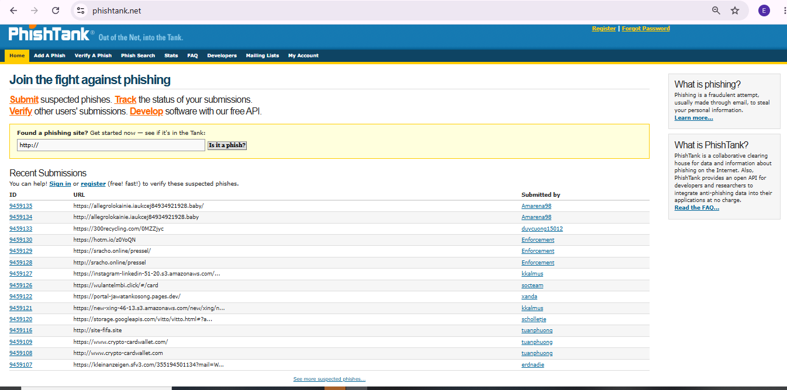
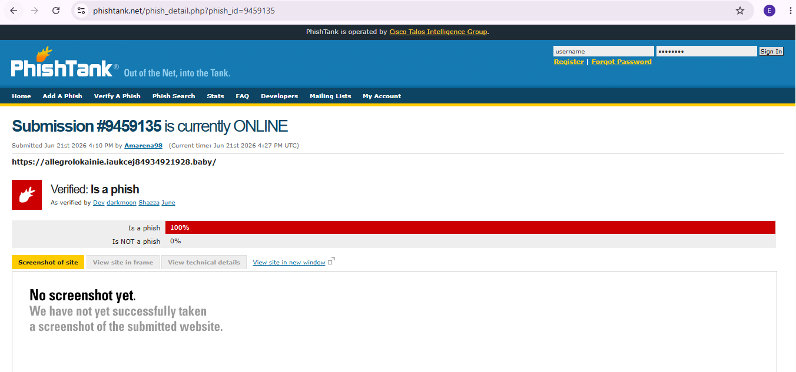
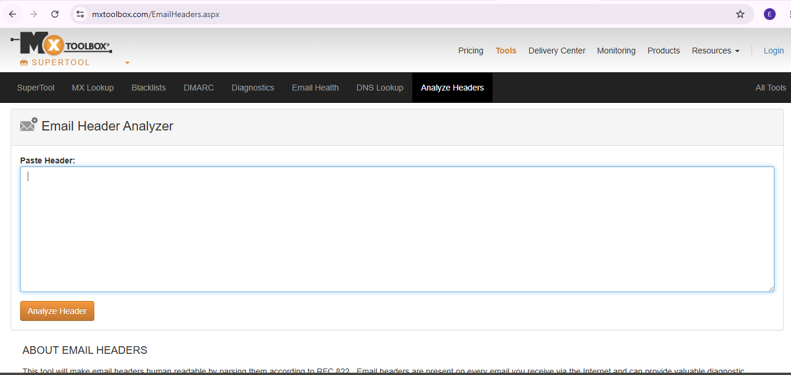
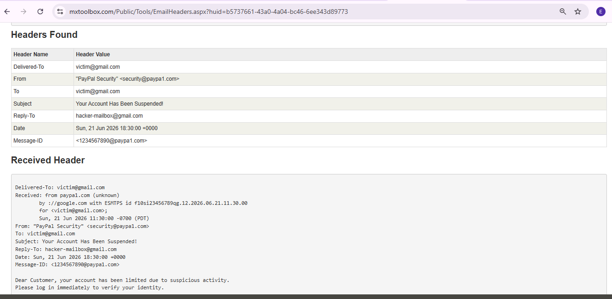
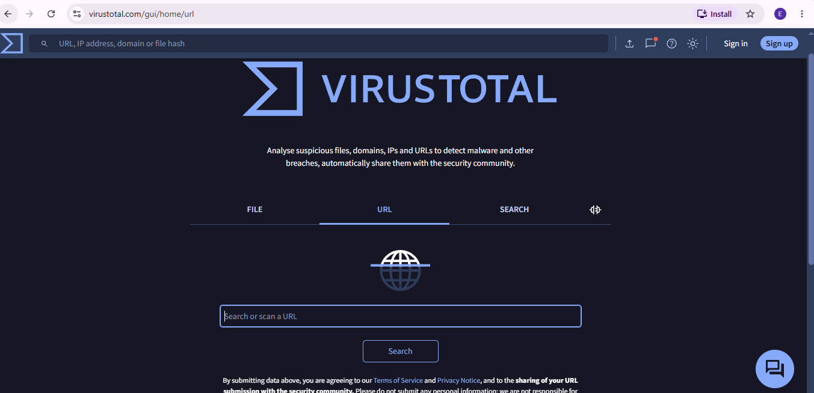
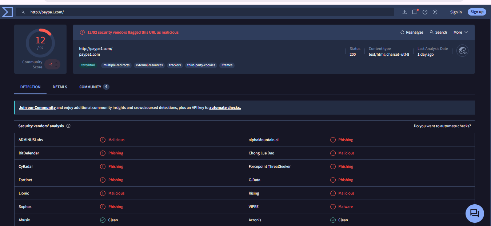

# Project 1 — Phishing Email Investigation (PayPal Spoof)

---

## Objective
I investigated a phishing email impersonating PayPal that claimed the recipient's account was locked. My initial hypothesis was **domain spoofing** — the email likely used a look-alike domain rather than the real `paypal.com`. I used three tools to confirm or rule this out: PhishTank for known threat data, MXToolbox for email header analysis, and VirusTotal for domain reputation scanning.

---

## Tools Used
| Tool | Purpose | Why I Chose It |
|---|---|---|
| PhishTank | Live phishing URL database | Lets you cross-reference a suspicious link against community-reported phishing cases |
| MXToolbox | Email header analysis | Reveals the real sender domain and routing info hidden behind the display name |
| VirusTotal | Multi-engine URL/domain reputation scan | Checks a domain against dozens of security vendors at once, not just one antivirus engine |

---

## Build Process

### Phase 1 — Accessing the Phishing Threat Database
Opened PhishTank's main platform to check current phishing trends and reported URLs.

### Phase 2 — Extracting a Live Threat Link
Navigated PhishTank's live submission feed and opened an active case (Submission ID: **9459135**) to inspect a real, currently-tracked phishing report.

### Phase 3 — Setting Up Email Header Analysis
Opened MXToolbox's Email Header Analyzer to inspect the hidden technical routing data behind the suspicious email.

### Phase 4 — Tracking Sender Spoofing & Mail Route Mismatches
Pasted the email's header data into the analyzer. The results confirmed the spoofing hypothesis and surfaced something worse:
- **Sender domain:** confirmed as the fake `paypa1.com` — not the real `paypal.com`
- **Reply-To mismatch:** any reply from the victim would route directly to `hacker-mailbox@gmail.com`, not PayPal

### Phase 5 — Preparing the Link Reputation Scan
With the fake domain confirmed via headers, moved to verify it independently using VirusTotal's URL scanner.

### Phase 6 — Final Reputation Scan Results
Scanned `paypa1.com` directly. The result: **12 security vendors** flagged the domain as malicious/phishing — independent confirmation of what the header analysis already showed.

---

## Verdict
**True Positive.** Confirmed phishing attack — spoofed domain, spoofed sender, and a reply-to redirect set up to capture victim responses directly.

---

## What I Missed
On first look, the visual trick worked — `paypa1.com` (with the numeral "1") is nearly indistinguishable from `paypal.com` (lowercase "l") at a glance, especially in a font where the two characters look almost identical. The spoof was only caught once I stopped relying on visual inspection and ran the domain through actual technical tools.

---

## Key Lessons Learned
- **Never trust the display name.** The visible sender name on an email means nothing — only the actual domain in the header matters.
- **Automate the check, don't eyeball it.** Look-alike domains are specifically designed to defeat a quick visual scan. Tools like MXToolbox and VirusTotal catch what the eye is built to miss.

---

## Real-World Application
This is standard SOC Tier 1 triage: a user reports a suspicious email, and the analyst has to move from "this looks off" to a documented, evidence-backed verdict (true positive / false positive) using header analysis and reputation tools — not gut feeling. The same workflow scales directly to real phishing queues.

---

## Evidence & Screenshots
| Screenshot | What It Shows |
|---|---|
| `S1_PhishTank_Home_Page.PNG` | PhishTank main platform, baseline reference |
| `S2_PhishTank_Link_Details.PNG` | Live phishing case (ID 9459135) details |
| `S3_MXToolbox_Analyzer_Page.PNG` | Email Header Analyzer tool, ready for input |
| `S4_MXToolbox_Analysis_Results.PNG` | Spoofed domain and Reply-To mismatch confirmed |
| `S5_VirusTotal_Home_Page.PNG` | VirusTotal URL scanner interface |
| `S6_VirusTotal_Scan_Results.PNG` | 12 vendors flag `paypa1.com` as malicious |

---

## Files
| File | Description |
|------|-------------|
| `README.md` | Full project documentation |

---

## References
- [PhishTank](https://phishtank.org/)
- [MXToolbox Email Header Analyzer](https://mxtoolbox.com/EmailHeaders.aspx)
- [VirusTotal](https://www.virustotal.com/)
