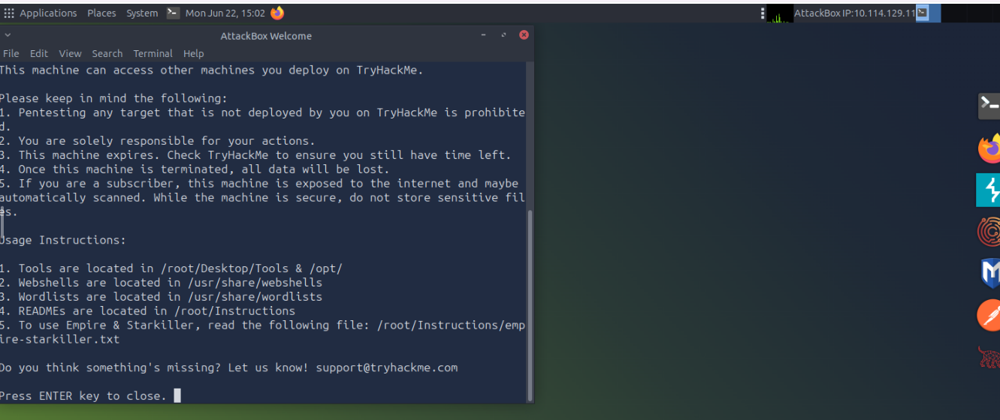
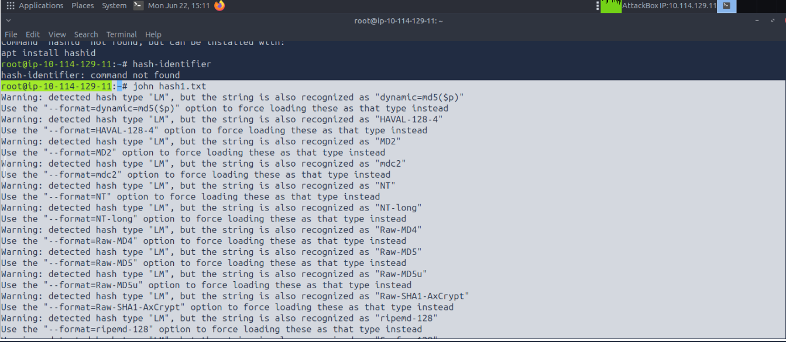
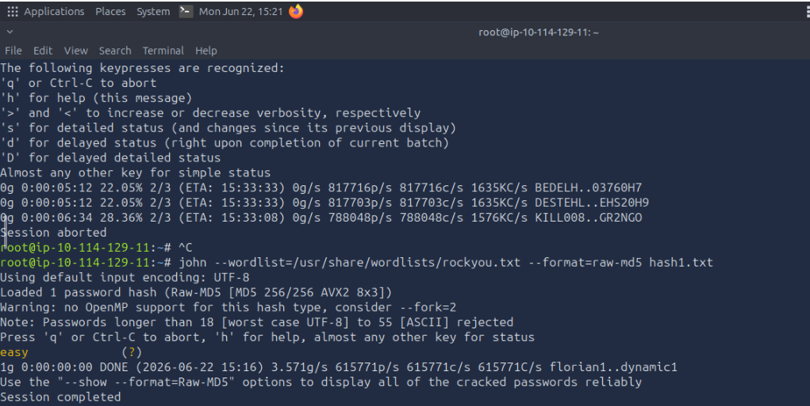
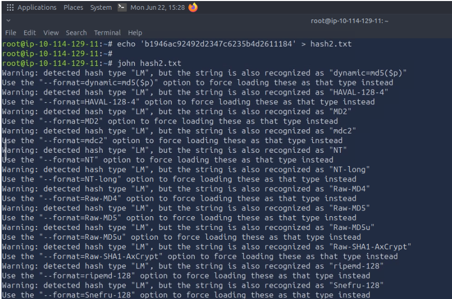
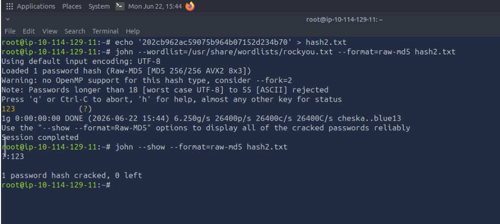
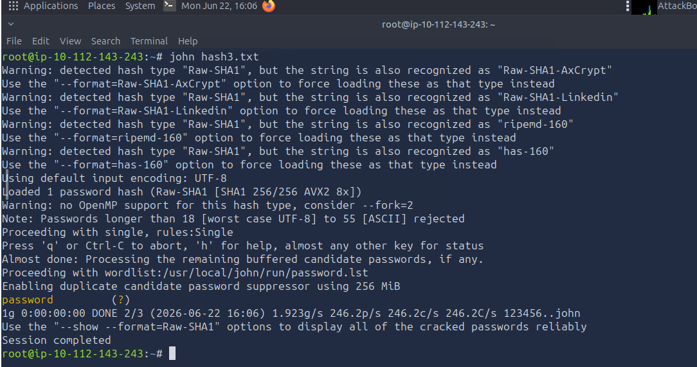
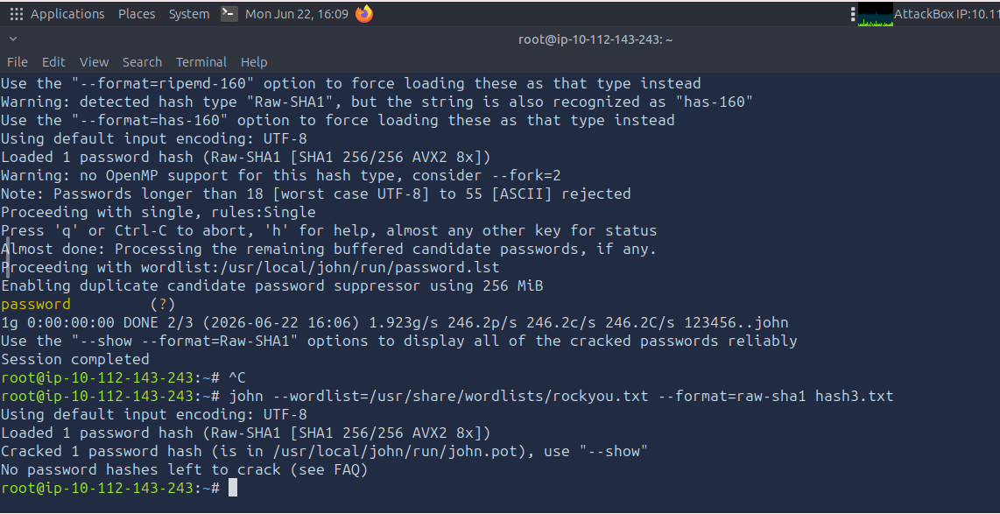
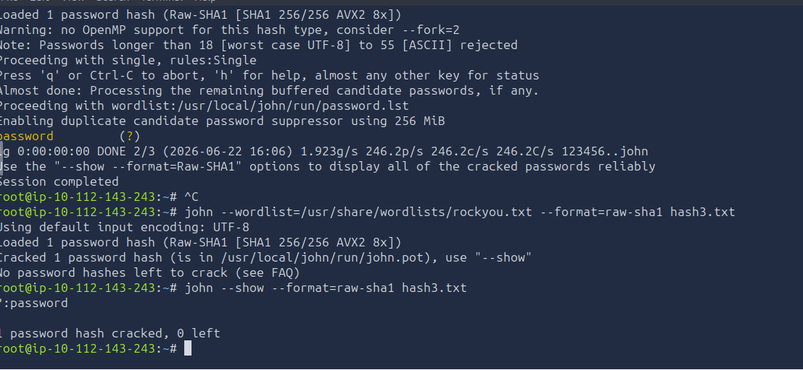

# Project 10 — Password Cracking & Hash Analysis


---

## Objective
I identified and cracked three password hashes using John the Ripper inside TryHackMe's "Crack the Hash" room, to practice dictionary-based password recovery and see firsthand how quickly weak, common passwords fall to a basic wordlist attack.

---

## Tools Used
| Tool | Purpose | Why I Chose It |
|---|---|---|
| `hashid` / hash-identifier | Hash type detection | Identifies the hash algorithm (MD5, SHA-1, etc.) before attempting to crack it |
| John the Ripper | Password cracking | Industry-standard cracking tool, supports dictionary attacks against many hash formats |
| `rockyou.txt` wordlist | Dictionary source | Built from real leaked password breaches — the same wordlist attackers actually use |

---

## Build Process

### Phase 1 — Starting the Room
Started the TryHackMe "Crack the Hash" room and AttackBox.



### Phase 2 — Hash 1: Identification
Identified the first hash's format.
```
48bb6e862e54f2a795ffc4e541caed4d
```
Identified as **MD5** (`raw-md5`).



### Phase 3 — Hash 1: Cracking
Ran John the Ripper against the hash with the `rockyou.txt` wordlist. Cracked password: **`easy`**, recovered in under a second.



### Phase 4 — Hash 2: Identification
```
202cb962ac59075b964b07152d234b70
```
Identified as **MD5** (`raw-md5`).



### Phase 5 — Hash 2: Cracking
Cracked password: **`123`**, recovered in under a second.



### Phase 6 — Hash 3: Identification
```
5baa61e4c9b93f3f0682250b6cf8331b7ee68fd8
```
Identified as **SHA-1** (`raw-sha1`).



### Phase 7 — Hash 3: Cracking Command
Ran John the Ripper against the SHA-1 hash with the `rockyou.txt` wordlist.



### Phase 8 — Hash 3: Cracked
Cracked password: **`password`**, confirmed with `0 left` (no remaining uncracked hashes in this batch).



---

## Results Table
| Hash | Type | Cracked Password | Time to Crack |
|---|---|---|---|
| `48bb6e862e54f2a795ffc4e541caed4d` | MD5 | `easy` | < 1 second |
| `202cb962ac59075b964b07152d234b70` | MD5 | `123` | < 1 second |
| `5baa61e4c9b93f3f0682250b6cf8331b7ee68fd8` | SHA-1 | `password` | < 1 second |

---

## Key Lesson
All three passwords cracked in under a second — not because the hashing algorithm was weak, but because the underlying passwords were extremely common. `rockyou.txt` is built from real leaked password breaches, so any password that's ever shown up in a major leak gets caught almost instantly. **Crack speed has nothing to do with hash algorithm strength and everything to do with how predictable the password itself is.** A strong hash protecting a weak password is still a weak password.

---

## Real-World Application
This is exactly what an attacker does after obtaining a leaked password database: run every hash against a wordlist like `rockyou.txt` and harvest whatever falls out instantly — which, in real breaches, is often a meaningful percentage of all accounts. For a SOC/security role, the practical takeaway is the same lesson from the defensive side: enforce real password complexity policies, monitor for credential-stuffing and brute-force attempts, and treat "the hash algorithm is strong" as no protection at all if the password behind it is common.

---

## Evidence & Screenshots
| Screenshot | What It Shows |
|---|---|
| `SS1_Room_Started.PNG` | TryHackMe room and AttackBox started |
| `SS2_Hash1_Identify.PNG` | Hash 1 identified as MD5 |
| `SS3_Hash1_Cracked.PNG` | Hash 1 cracked — password `easy` |
| `SS4_Hash2_Identify.PNG` | Hash 2 identified as MD5 |
| `SS5_Hash2_Cracked.PNG` | Hash 2 cracked — password `123` |
| `SS6_Hash3_Identify.PNG` | Hash 3 identified as SHA-1 |
| `SS7_Hash3_Crack_Command.PNG` | John the Ripper running against Hash 3 with `rockyou.txt` |
| `SS8_Hash3_Cracked.PNG` | Hash 3 cracked — password `password`, `0 left` |

---

## Files
| File | Description |
|------|-------------|
| `README.md` | Full project documentation |

---

## References
- [TryHackMe — Crack the Hash](https://tryhackme.com/room/crackthehash)
- [John the Ripper](https://www.openwall.com/john/)
