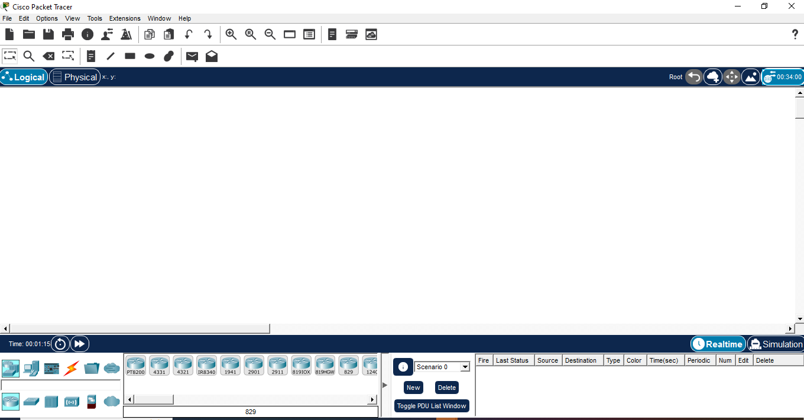
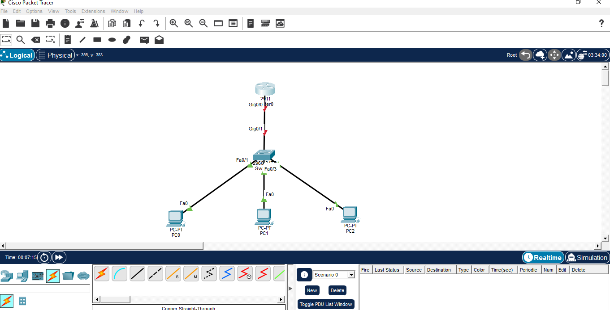
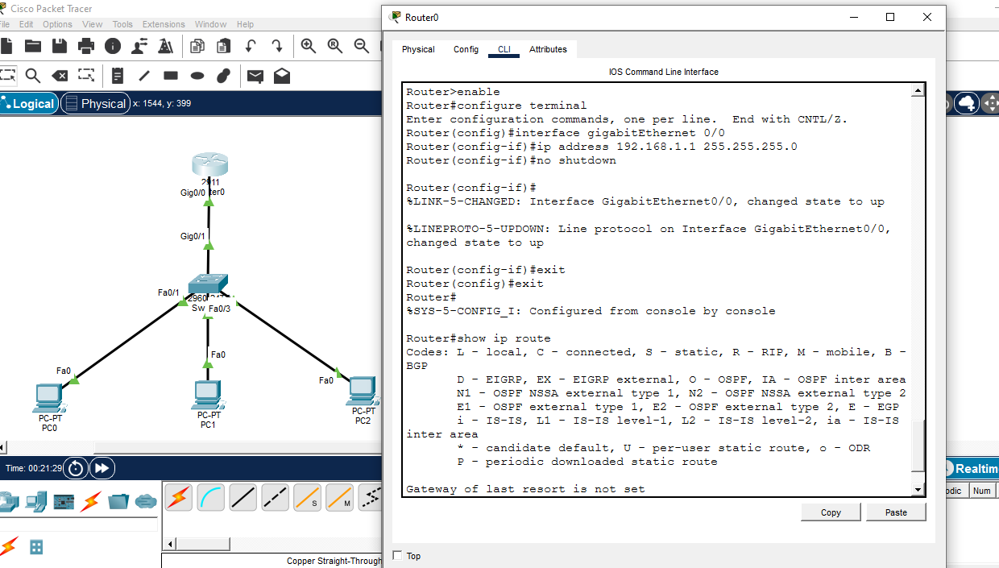
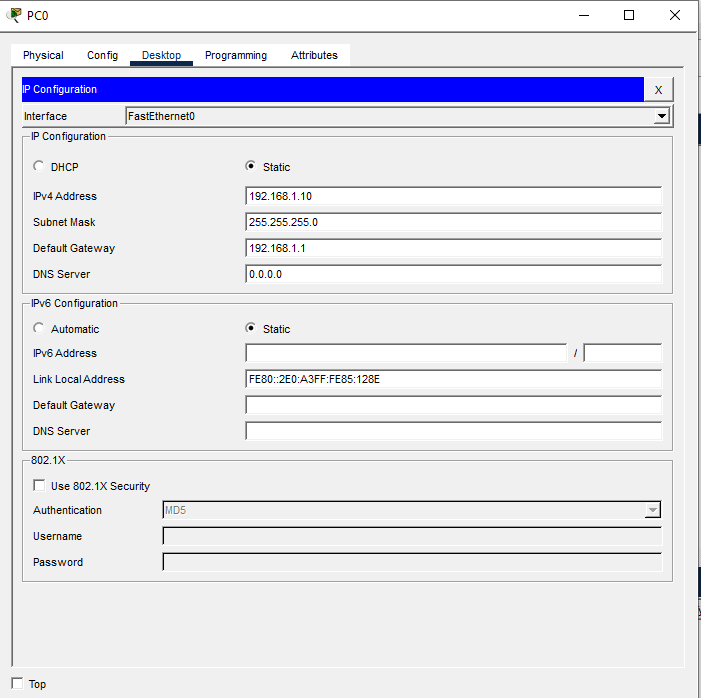
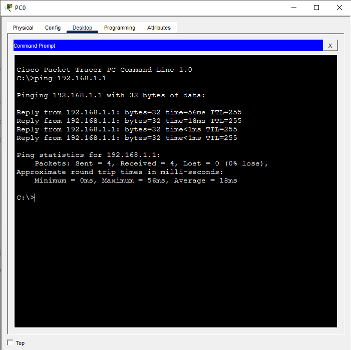
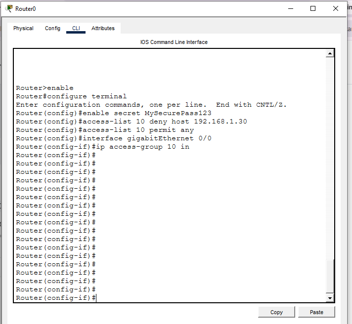
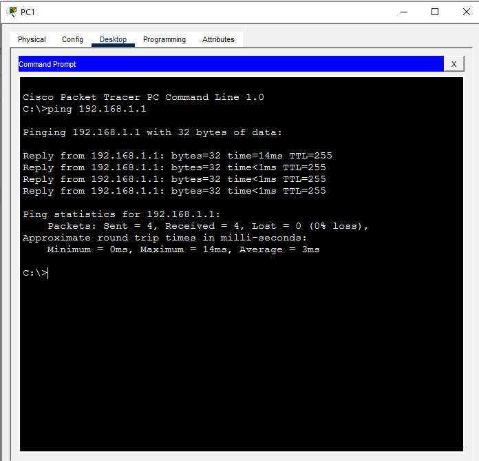
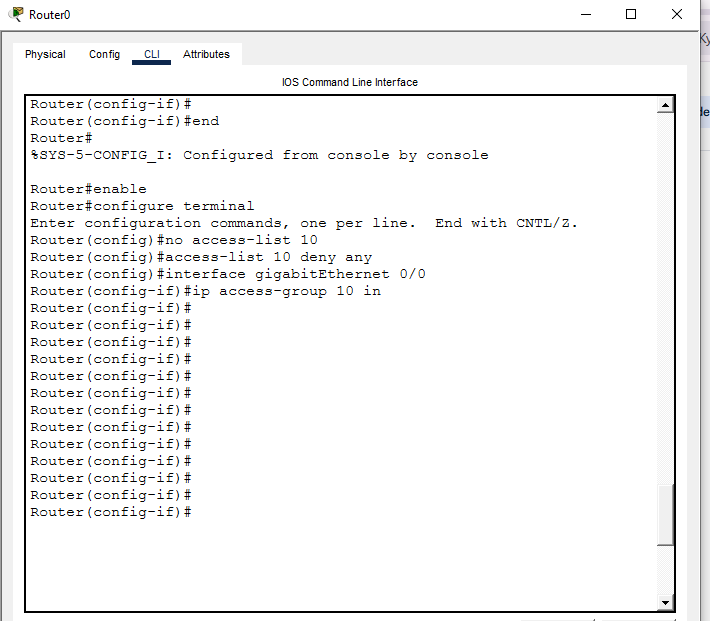
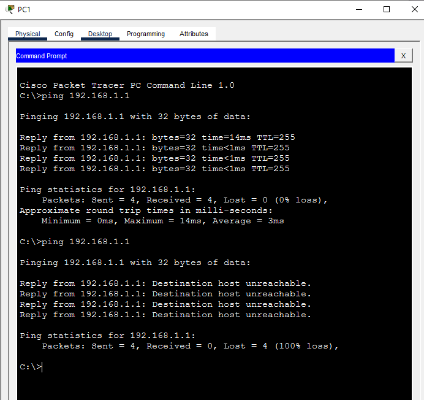

# Project 2 — Cisco Infrastructure & Secure Routing (Networking)


---

## Objective
I built a small company network topology in Cisco Packet Tracer — configured a router and switch, assigned static IPs to three end devices, then implemented an Access Control List (ACL) to restrict a specific host's access. The goal was to practice both **basic network setup** and **firewall rule configuration**, including catching and fixing a real misconfiguration along the way.

---

## Tools Used
| Tool | Purpose | Why I Chose It |
|---|---|---|
| Cisco Packet Tracer | Network design and simulation | Industry-standard tool for CCNA-level network design, routing, and ACL testing |

---

## Build Process

### Phase 1 — Workspace Setup
Opened Cisco Packet Tracer to a blank workspace, ready to place devices.



### Phase 2 — Network Topology Design
Placed the core devices and connected them:
- 1 Router (2911 model) — controls the network
- 1 Switch (2960 model) — connects the end devices
- 3 PCs (PC0, PC1, PC2)

Connected everything with Copper Straight-Through cables: each PC to a separate switch port, and the switch to the router's GigabitEthernet 0/0 port. At this stage the router-switch link showed red link lights — router was not yet active.



### Phase 3 — Router Configuration
Opened the router's CLI and ran:
```
enable
configure terminal
interface gigabitEthernet 0/0
ip address 192.168.1.1 255.255.255.0
no shutdown
exit
exit
show ip route
```
`no shutdown` activated the interface — link lights turned green immediately. `show ip route` confirmed the network as directly connected in the routing table.



### Phase 4 — Static IP Assignment on PCs
Assigned static IPs to each PC through Desktop > IP Configuration:

| Device | IP Address | Subnet Mask | Gateway |
|---|---|---|---|
| PC0 | 192.168.1.10 | 255.255.255.0 | 192.168.1.1 |
| PC1 | 192.168.1.20 | 255.255.255.0 | 192.168.1.1 |
| PC2 | 192.168.1.30 | 255.255.255.0 | 192.168.1.1 |



### Phase 5 — Connectivity Test
Opened PC0's Command Prompt and ran `ping 192.168.1.1`. Got 4 successful replies — confirmed the network was fully functional before adding any security rules.



### Phase 6 — First Firewall Rule
Went back to the router CLI to add a password and a basic ACL intended to block PC2 (192.168.1.30):
```
enable
configure terminal
enable secret MySecurePass123
access-list 10 deny host 192.168.1.30
access-list 10 permit any
interface gigabitEthernet 0/0
ip access-group 10 in
```



### Phase 7 — Error: Firewall Bypass
Tested the rule from PC1 (192.168.1.20), expecting it to behave like a locked-down network. Ran `ping 192.168.1.1` from PC1 — **it succeeded.**

**Why:** The ACL only explicitly denied PC2 (`192.168.1.30`). The line `access-list 10 permit any` meant every other host — including PC1 — was allowed straight through. The rule did exactly what it was written to do; the mistake was assuming it would restrict the network more broadly than it actually did.



### Phase 8 — Fix: Hardened ACL
Returned to the router CLI, removed the old rule, and replaced it with a default-deny rule to close the gap:
```
enable
configure terminal
no access-list 10
access-list 10 deny any
interface gigabitEthernet 0/0
ip access-group 10 in
```



### Phase 9 — Final Verification
Re-tested from PC1 with `ping 192.168.1.1` a third time. This time it failed with `Destination host unreachable` — confirming the hardened rule now blocked traffic as intended.



---

## What I Got Wrong
- Assumed an ACL that denied one specific host (PC2) would tighten security for the whole network. It didn't — `permit any` at the end of the list meant every other host, including PC1, stayed fully open.
- Only tested the host I expected to fail (PC2 was never re-tested directly in this sequence) instead of also testing a host that should have still been allowed, which is what exposed the gap.

---

## Key Lesson
ACLs are explicit, not assumed. Every host not specifically denied is implicitly permitted unless a default-deny rule is added. **Testing only the host you expect to block isn't enough** — you also need to test a host that should still pass, to confirm the rule's actual scope matches your intended scope. This is one of the most common real-world firewall misconfigurations: admins block the few things they thought of and leave everything else open by default.

---

## Real-World Application
This is the exact failure mode behind many real network security incidents — a firewall or ACL that looks restrictive on paper but has an overly broad default-allow behavior underneath. Network engineers and SOC analysts both need to verify ACL/firewall scope by testing edge cases, not just the obvious target, before trusting a rule is doing what it's supposed to.

---

## Evidence & Screenshots
| Screenshot | What It Shows |
|---|---|
| `1_Cisco_Packet_Tracer_Workspace.PNG` | Blank Packet Tracer workspace |
| `2_Network_Topology_Design.PNG` | Router, switch, and 3 PCs connected |
| `3_Router_IP_and_Routing_Table.PNG` | Router interface activated, routing table verified |
| `4_PC_IP_Configuration.PNG` | Static IP configuration on all 3 PCs |
| `5_Ping_Success_Test.PNG` | Initial connectivity test, pre-firewall |
| `6_Router_First_Firewall_Rules.PNG` | First ACL rule blocking PC2 |
| `7_PC1_Firewall_Bypass_Ping_Success.PNG` | Bypass discovered — PC1 ping succeeds unexpectedly |
| `8_Router_Firewall_Fix_Commands.PNG` | Hardened ACL with default-deny rule |
| `9_Firewall_Block_Success.PNG` | Final verification — ping blocked as intended |

---

## Files
| File | Description |
|------|-------------|
| `README.md` | Full project documentation |

---

## References
- [Cisco Packet Tracer Official Page](https://www.netacad.com/courses/packet-tracer)
- [Cisco ACL Configuration Guide](https://www.cisco.com/c/en/us/support/docs/security/ios-firewall/23602-confaccesslists.html)
