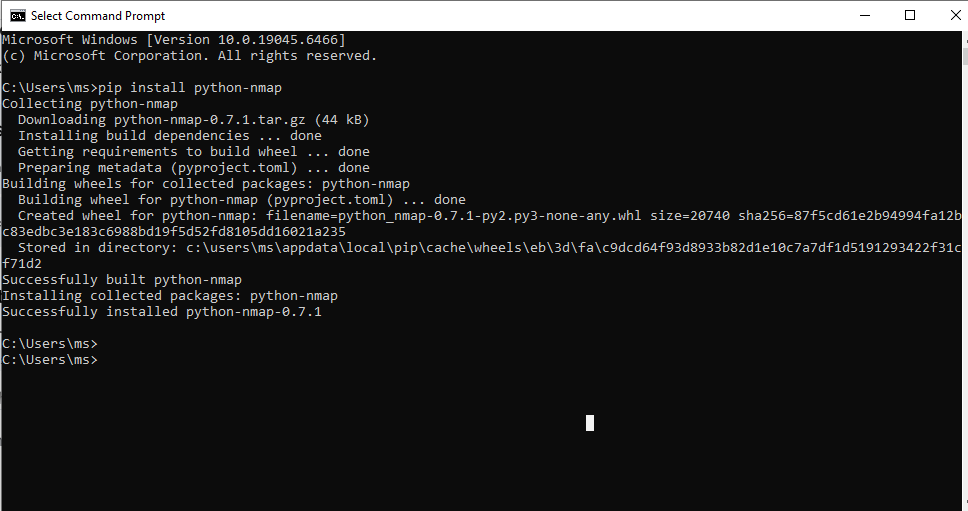
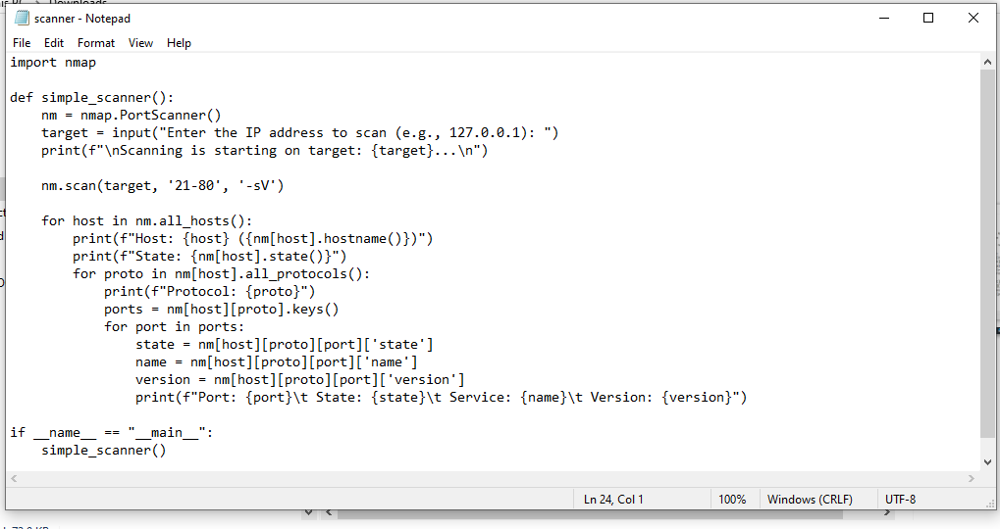
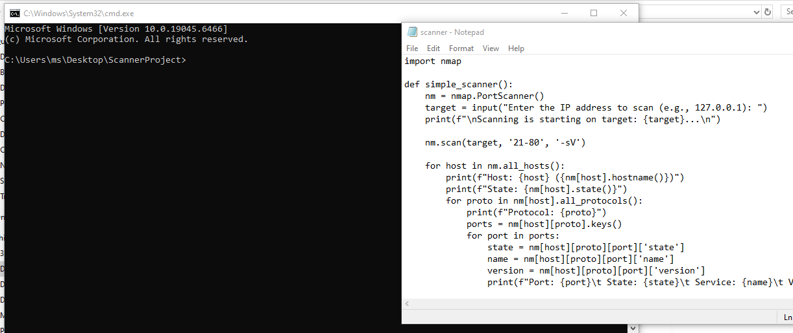
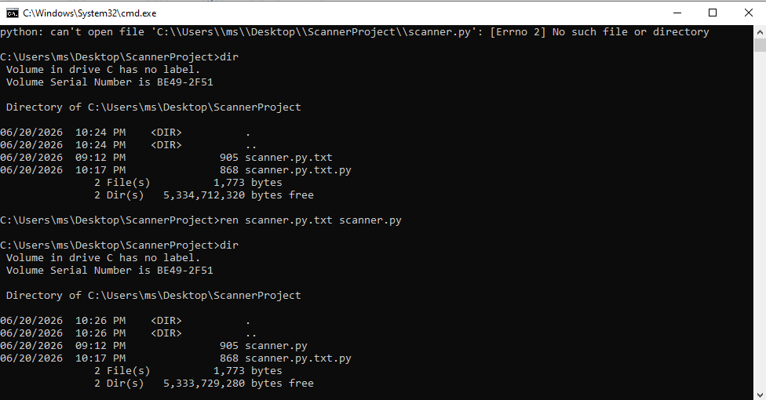
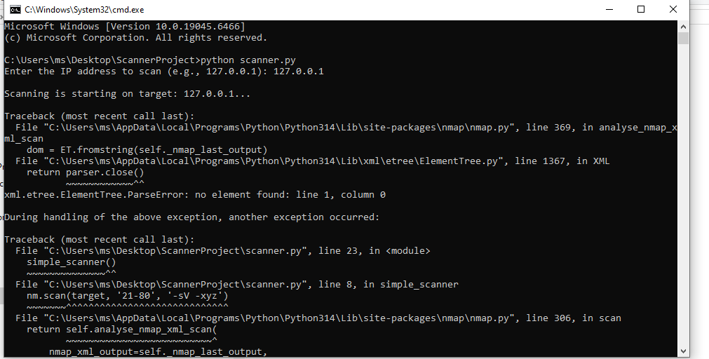
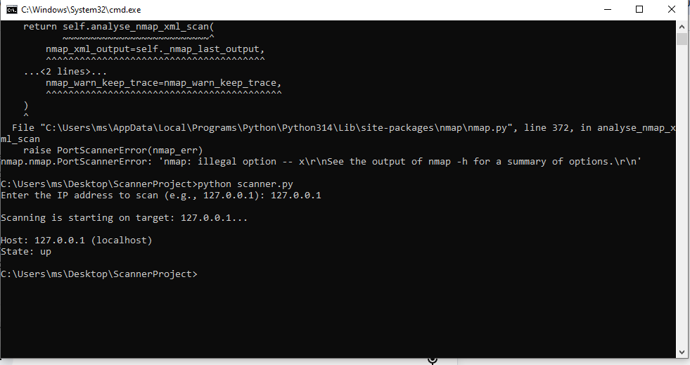

# Project 3 — Automated Port & Service Scanner (Python + Nmap)


---

## Objective
I built a Python script that **automates port scanning using Nmap**, so I could run a scan and get **open ports, host status, and running service versions** printed automatically — instead of manually typing Nmap commands and reading raw terminal output every time.

---

## Tools Used
| Tool | Purpose | Why I Chose It |
|---|---|---|
| Python 3.14 | Script logic and automation | Easy to wrap external tools and process their output |
| Nmap | Underlying scan engine | Industry-standard network scanning tool |
| Npcap | Packet capture driver | Required by Nmap for raw scanning on Windows |
| python-nmap | Python-to-Nmap interface | Lets Python call Nmap and parse results directly |

---

## Build Process

### Phase 1 — Environment Setup
Installed Python with PATH enabled, then installed the `python-nmap` library:
```
pip install python-nmap
```


### Phase 2 — Script Creation
Wrote the initial version of `scanner.py` and saved it in a project folder. (Note: this version did not yet include the `--unprivileged` flag — that was added later in Phase 6 as part of fixing the Nmap scan error.)

[View final scanner.py](./scanner.py)



### Phase 3 — Error: Hidden File Extension
Running `python scanner.py` failed with "file not found." Used `dir` to inspect the folder and found **Windows had silently saved the file as `scanner.py.txt`** instead of `scanner.py`.



**Fix:** Ran this command, which **removed the `.txt` extension and corrected the filename**:
```
ren scanner.py.txt scanner.py
```


### Phase 4 — Error: Nmap Not Installed / Stale PATH
Script ran but failed because **Nmap was only downloaded, not installed**. Installed Nmap and Npcap as administrator. After install, a second error (`'python' is not recognized`) appeared because **the open CMD session hadn't refreshed its PATH**.

**Fix:** Closed the old CMD window, opened a new one in the project folder.

*(No screenshot available for this specific error — it occurred during an earlier run and was resolved before the lab was redone.)*

### Phase 5 — Error: Invalid Nmap Argument
While testing different scan arguments during a later run, ran the script with an invalid flag (`-xyz`). This caused Nmap to return no valid output, which the `python-nmap` library couldn't parse, producing this error:
```
xml.etree.ElementTree.ParseError: no element found: line 1, column 0
```



**Fix:** Replaced the invalid flag with the correct, valid Nmap arguments (`-Pn --unprivileged`) in Phase 6.

### Phase 6 — Scan Configuration
Adjusted the scan call to avoid Windows network adapter interference:
```python
nm.scan(target, '21-80', '-sV -Pn --unprivileged')
```
- `-sV`: detect service versions
- `-Pn`: skip host discovery ping
- `--unprivileged`: avoid requiring raw socket permissions

### Phase 7 — Result
```
Host: 127.0.0.1 (localhost)
State: up
```
**Script successfully returned host status without errors.**



---

## What I Got Wrong
- Assumed the Nmap installer being **downloaded** meant it was **installed** — it wasn't. The error message at that stage didn't make the difference obvious.
- Assumed the script file was named correctly without checking. Windows had silently saved it as `scanner.py.txt` instead of `scanner.py`, hiding the real extension.
- Spent time suspecting the Python code itself was wrong, before checking these two basic environment issues first.

---

## Key Lesson
When a script fails right after installing new software, **check two things first**: whether the software **actually finished installing** (not just downloaded), and whether the current terminal session **has the updated PATH**. Most "tool not found" errors at this stage are **environment issues, not syntax errors**.

---

## Real-World Application
A scanner like this is the starting point for **automated asset discovery** — running scheduled scans across a network range and **flagging new open ports or unexpected services**. The current version would need two upgrades before real use: **scanning beyond localhost** (a real subnet or test VM), and **cross-referencing detected service versions against a CVE database** (e.g. via `--script vuln`) to move from port detection to actual vulnerability detection.

---

## Evidence & Screenshots
| Screenshot | What It Shows |
|---|---|
| `1_Python_Installation.PNG` | Python installed successfully |
| `2_Scanner_Code.PNG` | scanner.py code in Notepad |
| `3_Extension_Error_Check.PNG` | Hidden `.txt` extension discovered via `dir` |
| `4_File_Renamed_Fix.PNG` | File renamed correctly to `scanner.py` |
| `5_Nmap_Path_Error.PNG` | Nmap/PATH error before fix |
| `6_Final_Scan_Success.PNG` | Successful scan result on localhost |

---

## Files
| File | Description |
|------|-------------|
| `README.md` | Full project documentation |
| `scanner.py` | Python script source code |

---

## References
- [Nmap Official Documentation](https://nmap.org/book/man.html)
- [python-nmap Library Documentation](https://pypi.org/project/python-nmap/)
