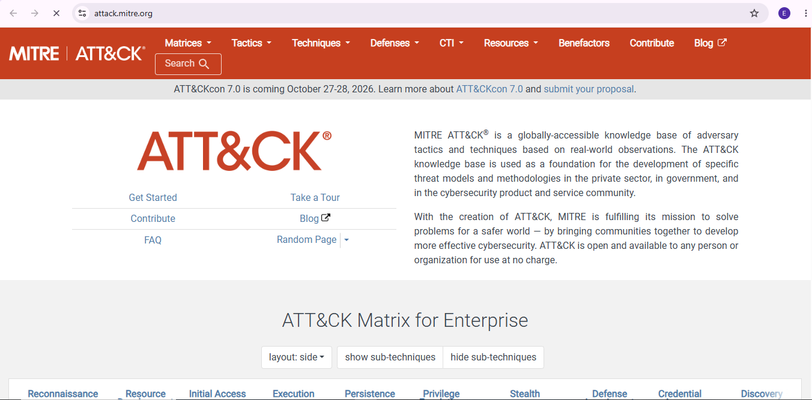
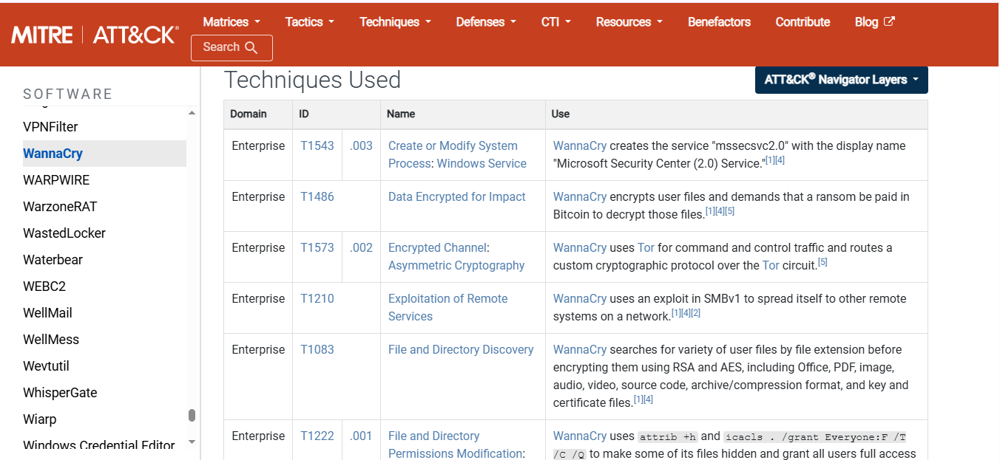
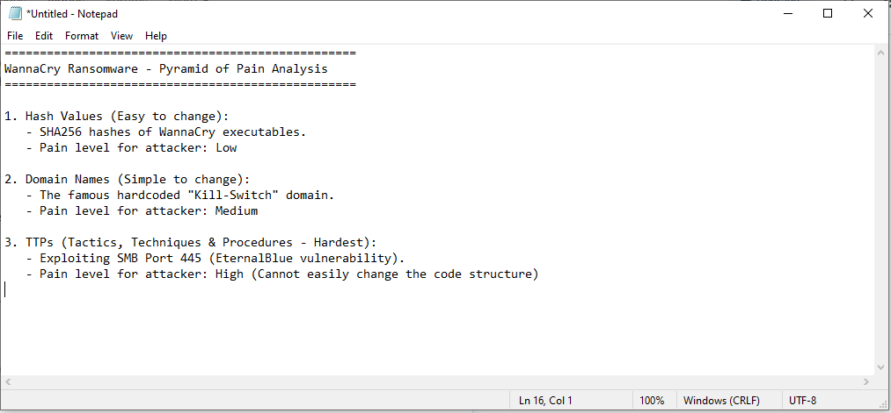
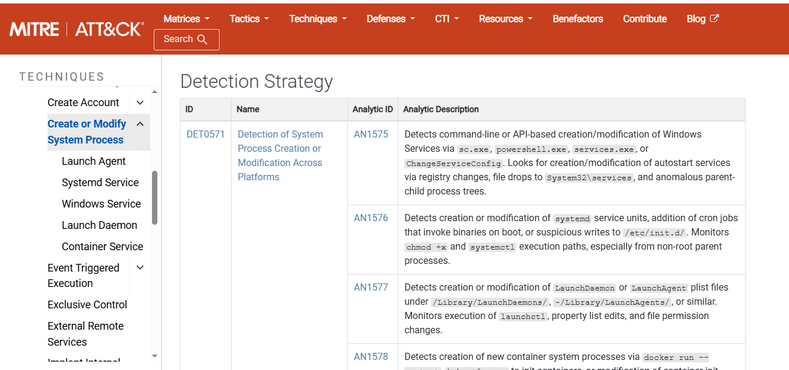
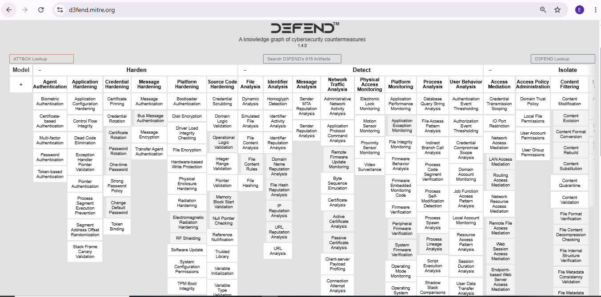

# Project 4 — Threat Framework Mapping & Malware Case Study (WannaCry Ransomware)

---

## Objective
I analyzed the 2017 **WannaCry ransomware** attack by mapping it across three industry-standard frameworks: the **MITRE ATT&CK Matrix** (attacker techniques), the **Pyramid of Pain** (how hard each type of indicator is for an attacker to change), and **MITRE D3FEND** (defensive countermeasures). The goal was to go beyond "what happened" and build out how a SOC would actually detect and stop this specific attack.

---

## Tools Used
| Tool / Framework | Purpose | Why I Chose It |
|---|---|---|
| MITRE ATT&CK Matrix | Maps real-world attacker tactics and techniques | Industry-standard reference for adversary behavior, used directly in SOC detection engineering |
| MITRE D3FEND | Maps defensive countermeasures to specific attack techniques | Direct defensive counterpart to ATT&CK — shows how to actually stop a technique, not just identify it |
| Pyramid of Pain | Ranks indicator types by how costly they are for an attacker to change | Core SOC triage model — shows why chasing file hashes is weak and targeting TTPs is strong |

---

## Build Process

### Phase 1 — Establishing the Baseline
Opened the MITRE ATT&CK Framework's official database to use as the reference point for the investigation — the global matrix of known adversary tactics and techniques.

### Phase 2 — Extracting WannaCry's Technical Profile
Navigated to the Software database and located WannaCry's profile (ID: **S0366**) to pull its documented Tactics, Techniques, and Procedures (TTPs) — the specific actions the malware took to spread and lock down systems.

### Phase 3 — Mapping Indicators to the Pyramid of Pain
Categorized WannaCry's known indicators — file hashes, network domains, and TTPs — against the Pyramid of Pain model. File hashes sit at the bottom (easy for an attacker to change); the malware's actual operational behavior, like exploiting SMB port 445, sits at the top (hardest for an attacker to change, highest "pain" if blocked).

### Phase 4 — Drilling Into Detection Strategy
Drilled into technique **T1543** (Create or Modify System Process) to pull the specific detection guidance: monitoring for unusual use of system utilities like `sc.exe` and `powershell.exe`, which WannaCry abuses to create a fake service (`mssecsvc2.0`) for persistence.

### Phase 5 — Mapping Defensive Countermeasures
Switched from the attacker's perspective to the defender's by opening the MITRE D3FEND matrix. Mapped specific architectural controls relevant to this attack — process self-modification detection and network traffic analysis — to the techniques identified in the earlier phases.

---

## Key Takeaways
- WannaCry's core weakness for defenders is its reliance on an **unpatched network protocol (SMB)** to spread laterally — patching alone closes the primary attack vector.
- Chasing file hashes is a weak detection strategy since attackers can change them trivially. Detecting the malware's **behavior** (unauthorized process creation, anomalous service creation) is far more durable, because that's harder for an attacker to alter without changing how the malware fundamentally operates.
- Mapping a single piece of malware across ATT&CK, Pyramid of Pain, and D3FEND together — rather than using one framework in isolation — gives a more complete picture: what it did, why some indicators are weak, and what specifically stops it.

---

## Real-World Application
This is the core workflow of a Threat Intelligence or Detection Engineering role: take a known threat, map its techniques to a standard framework, identify which indicators are durable versus disposable, and translate that into concrete detection logic a SOC can actually deploy (specific processes, ports, or behaviors to alert on — not just "block this hash").

---

## Evidence & Screenshots
| Screenshot | What It Shows |
|---|---|
| `SS-1_Mitre_Attack_Framework_Home.PNG` | MITRE ATT&CK Matrix homepage / baseline reference |
| `SS-2_WannaCry_Technique_Mapping.PNG` | WannaCry's profile (S0366) and documented TTPs |
| `SS-3_Pyramid_of_Pain_Notes.PNG` | WannaCry indicators mapped to the Pyramid of Pain |
| `SS-4_WannaCry_Detection_Controls.PNG` | T1543 detection strategy — process monitoring guidance |
| `SS-5_Mitre_D3fend_Defensive_Matrix.PNG` | Defensive countermeasures mapped from D3FEND |

---

## Files
| File | Description |
|------|-------------|
| `README.md` | Full project documentation |

---

## References
- [MITRE ATT&CK Matrix](https://attack.mitre.org/)
- [MITRE D3FEND Matrix](https://d3fend.mitre.org/)
- [The Pyramid of Pain — Original Model](https://detect-respond.blogspot.com/2013/03/the-pyramid-of-pain.html)
