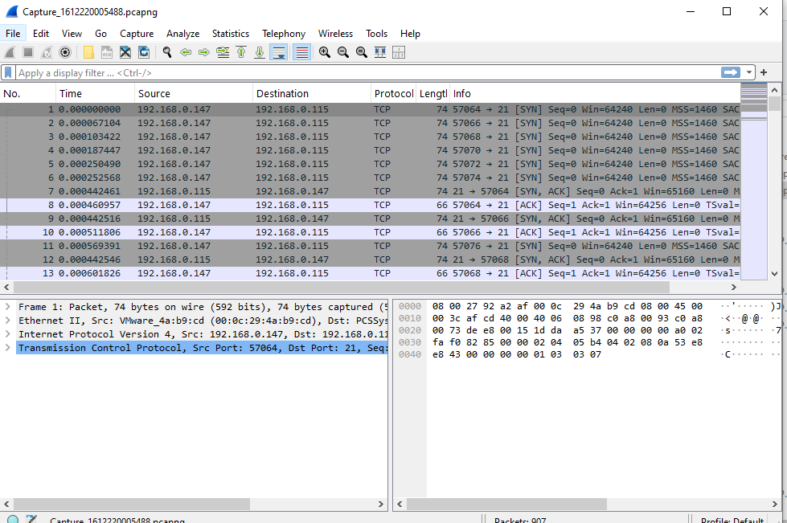
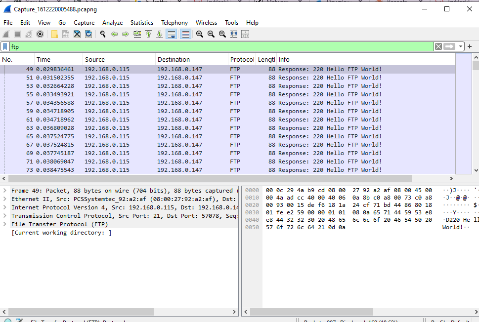
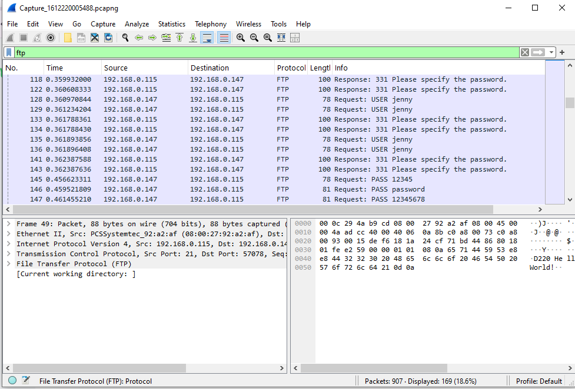
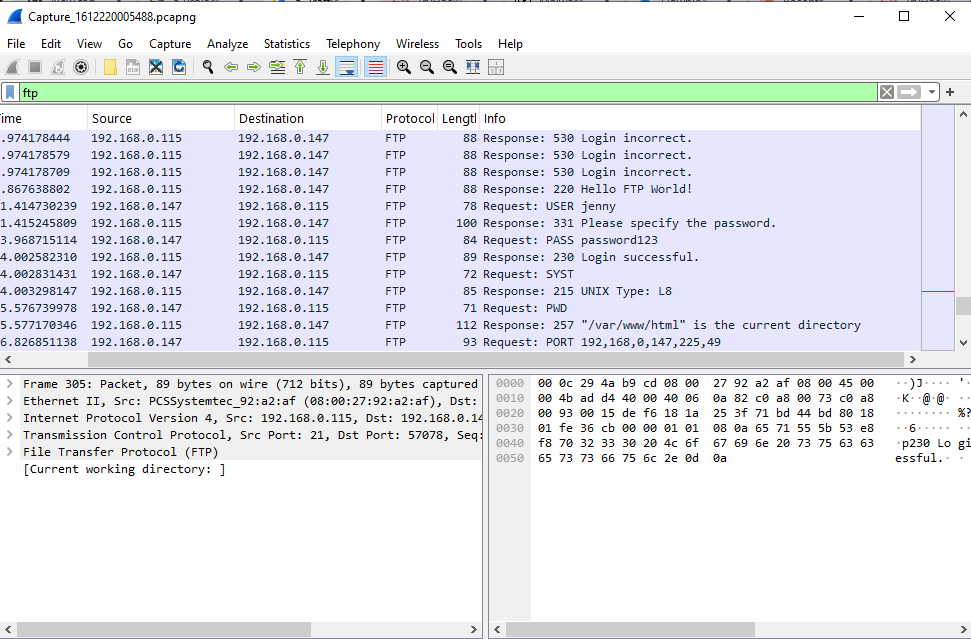
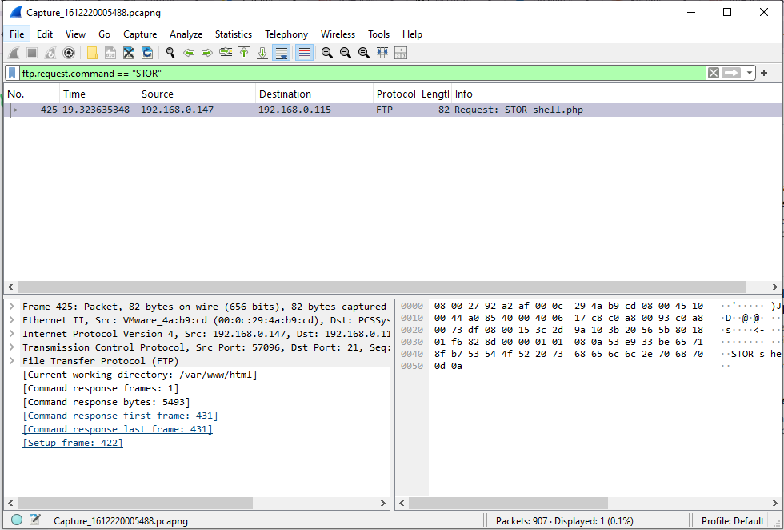
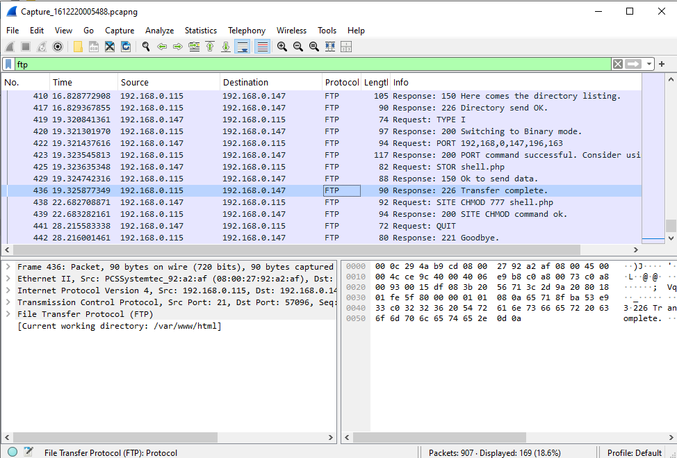

# Project 5 — Network Forensics: FTP Brute Force & Malware Upload Detection (Wireshark)


---

## Objective
I analyzed a packet capture file to **reconstruct a full attack chain** — from the moment an attacker connects, through credential brute-forcing, to malware upload and permission escalation — using only Wireshark filters. The goal was to practice reading raw network traffic the way a SOC analyst would during an incident investigation, instead of relying on summarized alerts.

---

## Tools Used
| Tool | Purpose | Why I Chose It |
|---|---|---|
| Wireshark | Packet capture analysis | Industry-standard tool for reading raw network traffic |
| TryHackMe ("h4cked" room) | Lab environment | Free room providing a realistic FTP attack capture file |

---

## Build Process

### Phase 1 — Finding a Usable Lab File
Needed a real attack capture to analyze. Most malware analysis rooms on TryHackMe are paid. Found a free room called **"h4cked"** instead, which provides a network capture file directly in Task 1 — no extra setup required.


### Phase 2 — Loading the Capture in Wireshark
Opened Wireshark, went to **File > Open**, and loaded the capture file. Thousands of raw packets appeared immediately — too many to scan manually.



### Phase 3 — Isolating the Attacker's Traffic
With thousands of packets on screen, applied the filter:
```
ftp
```
This isolated all FTP-related packets. Found a server response: `220 Hello FTP World!` — confirming an open FTP port and an active connection.

**Result:** Attacker IP identified as `192.168.0.147`. Victim machine IP: `192.168.0.115`.



### Phase 4 — Capturing the Brute Force Attempt
FTP sends credentials in plaintext, so anything the attacker types is visible. Scrolled through the filtered packets and found repeated login attempts:
- Username: `jenny`
- Failed password attempts: `12345`, `password`, `12345678`



### Phase 5 — Confirming the Breach
Continued scrolling and found packet #305: `230 Login successful`. The correct password was `password123`. Immediately after login, the attacker ran `PWD` and the server confirmed the working directory: `/var/www/html` — the main web folder on a Linux server.



### Phase 6 — Error: Manual Scrolling Failed to Find the Payload
Knew the attacker had likely uploaded a malicious file after gaining access, but the surrounding traffic volume was too high to spot it by scrolling.

**Fix:** Replaced manual scrolling with a targeted filter:
```
ftp.request.command == "STOR"
```
`STOR` is the FTP command for uploading a file. This filter cut out all unrelated traffic and surfaced packet #425 directly: `Request: STOR shell.php` — a PHP web shell backdoor.



### Phase 7 — Confirming Upload and Privilege Escalation
Cleared the command-specific filter and went back to the simple `ftp` filter to check the final packets.

- Packet #436: `226 Transfer complete` — confirms `shell.php` finished uploading.
- Packet #438: `SITE CHMOD 777 shell.php` — attacker set full read/write/execute permissions on the uploaded file so it could be run from the browser.
- Attacker then issued `QUIT` and disconnected.



---

## What I Got Wrong
- Tried to find the uploaded malware file by manually scrolling through traffic instead of filtering for the exact FTP command (`STOR`) that performs file uploads. Wasted time scanning packets that had nothing to do with the upload.
- Didn't filter by command type early — `ftp` alone was good enough to find the attacker, but not precise enough to isolate one specific action in a busy capture.

---

## Key Lesson
When a capture has a high volume of traffic, **don't scroll — filter by the specific protocol command tied to the action you're looking for** (e.g. `ftp.request.command == "STOR"` for uploads). A broad filter like `ftp` narrows things down; a command-specific filter pinpoints the exact packet. This is also a direct illustration of why **FTP should not be used in production environments** — every credential and file transfer in this capture was sitting in plaintext. SFTP or FTPS would have hidden all of this from an attacker doing the same traffic capture.

---

## Real-World Application
This is the core skill of incident response and SOC Tier 1/2 work: given a packet capture (from a SIEM alert, IDS trigger, or post-breach investigation), reconstruct **what the attacker actually did** — initial access method, credentials used, files dropped, and persistence/escalation steps — purely from traffic evidence. The same filter-driven approach scales to larger captures; the only difference is volume, not method.

---

## Evidence & Screenshots
| Screenshot | What It Shows |
|---|---|
| `0_Lab_File_Setup.png` | Free TryHackMe room and capture file located |
| `1_Wireshark_File_Open_Success.png` | Capture file loaded, raw packets visible |
| `2_FTP_Traffic_Filtered.png` | FTP filter applied, attacker IP identified |
| `3_Hacker_Credentials_Found.png` | Brute-force login attempts captured in plaintext |
| `4_Hacker_Login_Success_and_Directory.png` | Successful login and working directory confirmed |
| `5_Malware_File_Upload_Detected.png` | `STOR shell.php` — malware upload command isolated |
| `6_Malware_Transfer_Complete_and_Permissions.png` | Upload completion and `CHMOD 777` privilege escalation |

---

## Files
| File | Description |
|------|-------------|
| `README.md` | Full project documentation |
| `capture.pcapng` | Packet capture file analyzed (from TryHackMe "h4cked" room) |

---

## References
- [TryHackMe — h4cked Room](https://tryhackme.com/room/hacked)
- [Wireshark Official Documentation](https://www.wireshark.org/docs/)
- [FTP Protocol Overview — RFC 959](https://www.rfc-editor.org/rfc/rfc959)
