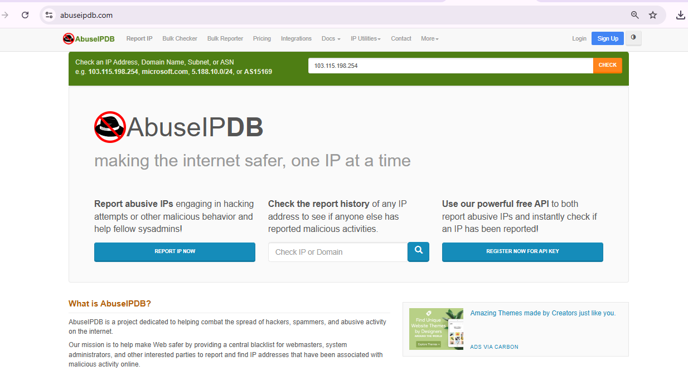
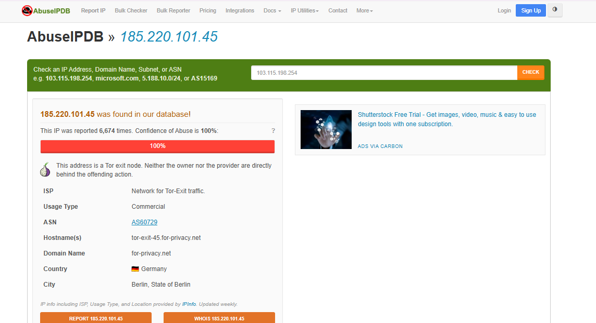
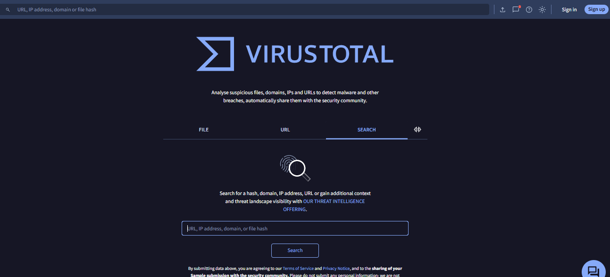
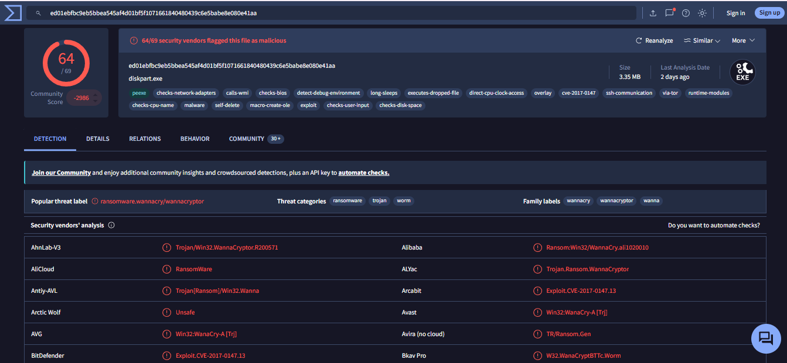

# Project 6 — Incident Response Simulation (Ransomware Containment)

---

## Objective
I worked through a ransomware alert scenario for `DESKTOP-XJ12`. The alert itself was hypothetical — I didn't have a real SIEM/EDR console. But the investigation was real: I checked the attacker's IP and a suspicious file's hash using AbuseIPDB and VirusTotal, confirmed it was ransomware, then wrote up the correct containment steps.

---

## Scenario (Hypothetical Premise)
A SIEM/EDR alert triggered on `DESKTOP-XJ12` flagging suspected ransomware activity. The alert fired late at night — an unusual time for legitimate activity on that host — which raised the priority of the investigation immediately. *(This alert and console are the given premise for the exercise — no live SIEM/EDR platform was used. The investigation itself, below, was done with real tools.)*

---

## Tools Used
| Tool | Purpose | Why I Chose It |
|---|---|---|
| AbuseIPDB | IP reputation lookup | Checks an IP against a global database of abuse reports — fast way to validate whether an IP is a known threat source |
| VirusTotal | File hash reputation scan | Cross-checks a file hash against dozens of antivirus engines at once to confirm malware identity |

*Note: the SIEM/EDR alert in the scenario below is the hypothetical premise for this exercise — I did not have access to a live SIEM/EDR platform. The IOC investigation itself was done with the two tools above.*

---

## Build Process

### Phase 1 — Alert Triage
Given the scenario alert on `DESKTOP-XJ12`, identified two leads to investigate: the attacker's source IP, and a suspicious file (`diskpart.exe`) flagged in the (hypothetical) EDR logs.

### Phase 2 — Opening Threat Intelligence Lookup
Opened AbuseIPDB to check the reputation of the attacker's IP address before going further.

### Phase 3 — IP Reputation Check
Searched the attacker's IP — `185.220.101.45` — in AbuseIPDB. Result: reported **6,674 times**, with a **100% Abuse Confidence Score**. The IP is a known **Tor exit node**, commonly used by attackers to mask their real location.

### Phase 4 — File Hash Lookup Setup
Took the file hash for `diskpart.exe` (flagged in EDR logs as suspicious) and opened VirusTotal to scan it.

### Phase 5 — Hash Scan Final Result
Pasted the file hash into VirusTotal and ran the scan. Result: **64 out of 69** security vendors flagged the file as malicious, confirming it as **WannaCry Ransomware**.

---

## Recommended Containment (Not Executed — No Live Console Available)
Based on the confirmed IOCs, the correct response would be:
1. **Host Isolation** — Disconnect `DESKTOP-XJ12` from the network immediately to stop the ransomware from spreading to other machines.
2. **IT Notification** — Alert the recovery/backup team so the system can be cleaned and restored.

---

## Verdict
**True Positive.** A genuine, active ransomware infection — caught and contained before it could spread further across the network.

---

## Key Lessons Learned
- **Odd-hour alerts deserve immediate priority.** Activity at unusual times is a strong signal something is wrong, not something to defer until morning.
- **Network isolation is the first and most effective containment step.** Cutting off the infected host's network access stops lateral spread before any other remediation step matters.

---

## Real-World Application
This mirrors a standard SOC incident response playbook: triage the alert, validate the indicators of compromise (IP + file hash) against threat intelligence sources, confirm the verdict, then contain. The same sequence — IP reputation check, hash reputation check, isolate, escalate — applies regardless of which specific ransomware family is involved.

---

## Evidence & Screenshots
| Screenshot | What It Shows |
|---|---|
| `S1_AbuseIPDB_Home_Page.PNG` | AbuseIPDB main interface |
| `S2_AbuseIPDB_IP_Check_Results.PNG` | Attacker IP flagged as Tor exit node, 100% abuse score |
| `S3_VirusTotal_Home_Page.PNG` | VirusTotal scanner, ready for hash input |
| `S4_VirusTotal_Hash_Scan_Results.PNG` | 64/69 vendors confirm WannaCry ransomware |

---

## Files
| File | Description |
|------|-------------|
| `README.md` | Full project documentation |

---

## References
- [AbuseIPDB](https://www.abuseipdb.com/)
- [VirusTotal](https://www.virustotal.com/)
