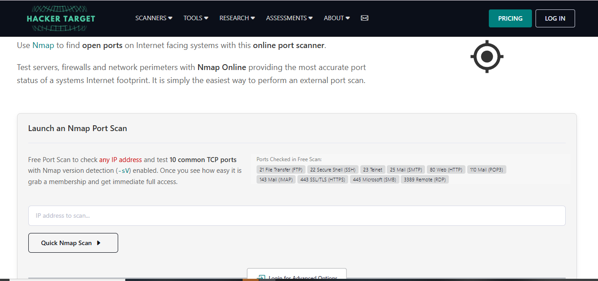
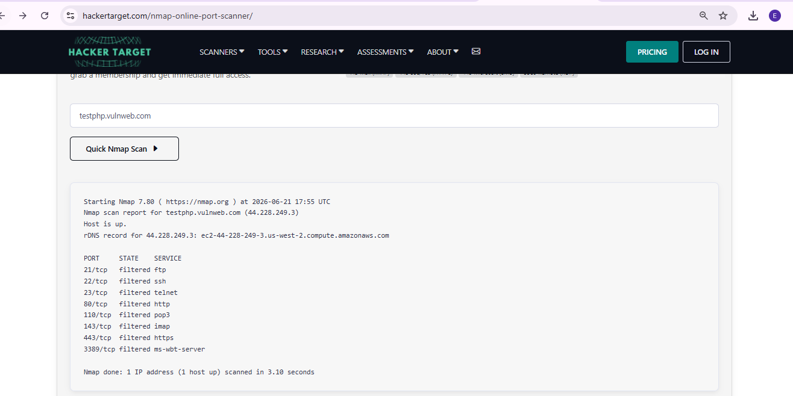

# Project 7 — Nmap Port Scan Reconnaissance (Filtered Port Analysis)


-orange)

---

## Objective
I ran a port scan against a public, intentionally vulnerable test target to check which common ports were open, closed, or filtered — and to correctly interpret what each result actually means. The key lesson of this project ended up being about **reading scan results accurately**, not just running a scan.

---

## Target & Tool
- **Target:** `testphp.vulnweb.com` (44.228.249.3) — a publicly available, intentionally vulnerable practice site maintained by Acunetix specifically for security testing. Safe and legal to scan.
- **Tool:** [HackerTarget's free online Nmap port scanner](https://hackertarget.com/nmap-online-port-scanner/) — runs Nmap with version detection (`-sV`) against 10 common TCP ports (FTP, SSH, Telnet, SMTP, HTTP, POP3, IMAP, HTTPS, SMB, RDP).

---

## Build Process

### Phase 1 — Opening the Scanner
Opened HackerTarget's online Nmap scanner. The page checks 10 common ports using Nmap's `-sV` version detection.



### Phase 2 — Running the Scan
Entered `testphp.vulnweb.com` as the target and ran the Quick Nmap Scan. Result:

```
PORT     STATE     SERVICE
21/tcp   filtered  ftp
22/tcp   filtered  ssh
23/tcp   filtered  telnet
80/tcp   filtered  http
110/tcp  filtered  pop3
143/tcp  filtered  imap
443/tcp  filtered  https
3389/tcp filtered  ms-wbt-server
```

Every single port came back **filtered** — not open, not closed.



---

## What "Filtered" Actually Means
This is the core finding of this project, and it's not what I expected going in:

- **Open** = a service is confirmed listening on that port.
- **Closed** = no service is listening, but the host responded.
- **Filtered** = Nmap's probe was dropped or blocked, most likely by a firewall, and it **cannot determine** whether a service is actually running.

A filtered result is not evidence of an open, exploitable service. It usually means a firewall is doing exactly what it's supposed to do.

---

## What I Got Wrong
I initially expected this scan to reveal genuinely open, insecure ports (the classic "Telnet and FTP wide open" finding) and started writing up a risk report around that assumption — before actually checking what the scan output said. The real result was every port showing `filtered`, which is a completely different finding. Treating a filtered result as if it were an open, vulnerable service would have been a false report.

---

## Key Lesson
**Filtered is not the same as open, and reporting it that way is a false positive.** In real reconnaissance work, an external scan against a properly firewalled target will often come back filtered — that's a sign the perimeter defense is working, not a sign of exposure. Jumping to a "critical vulnerability" conclusion from an inconclusive result is exactly the kind of mistake that damages an analyst's credibility. The correct move when ports come back filtered is to say so plainly, not to manufacture a finding that isn't there.

---

## Real-World Application
Distinguishing open/closed/filtered correctly is a basic but frequently-skipped skill in port scanning. Over-reporting filtered ports as open vulnerabilities creates noise and false alarms for a security team — the opposite of what reconnaissance is supposed to deliver. A scan that comes back fully filtered isn't a failed exercise; it's useful information about the target's perimeter, and should be reported as exactly that.

---

## Evidence & Screenshots
| Screenshot | What It Shows |
|---|---|
| `S1_Nmap_Recon_Dashboard_Page.PNG` | HackerTarget's online Nmap scanner, ready for input |
| `S2_Nmap_Service_Discovery_Results.PNG` | Scan results — all 8 checked ports returned `filtered` |

---

## Files
| File | Description |
|------|-------------|
| `README.md` | Full project documentation |

---

## References
- [HackerTarget Nmap Online Port Scanner](https://hackertarget.com/nmap-online-port-scanner/)
- [Nmap Port States Explained](https://nmap.org/book/man-port-scanning-basics.html)
