# Project 8 — SIEM Alert Triage (SOC Simulator)

---

## Objective
I worked as a Tier 1 SOC Analyst inside TryHackMe's SOC Simulator (Scenario 1 — Introduction to Phishing). My job was to investigate incoming alerts using SIEM logs and decide, with evidence, whether each one was a **True Positive** (real threat) or a **False Positive** (false alarm) — then document the verdict and any required action.

---

## Tools Used
| Tool | Purpose | Why I Chose It |
|---|---|---|
| TryHackMe SOC Simulator | Alert queue, case assignment, case reporting | Realistic Tier 1 SOC workflow — alert in, investigate, verdict, report |
| Splunk SIEM | Log search and historical event lookup | Lets you pivot from "this looks suspicious" to "here's the actual evidence" — the core SOC skill |

---

## Build Process

### Phase 1 — Opening the Simulator
Launched the SOC Simulator and confirmed Scenario 1 (Introduction to Phishing) loaded correctly.

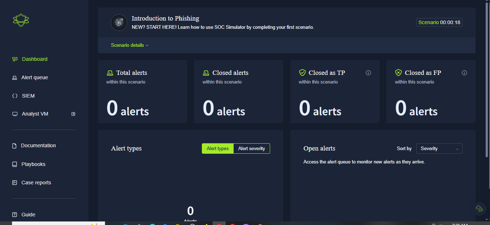

### Phase 2 — Reviewing the Alert Queue
Opened the alert queue — 5 pending alerts waiting. Picked up the first one:
- **Alert ID:** 8818
- **Alert Rule:** Inbound Email Containing Suspicious External Link
- **Severity:** Medium

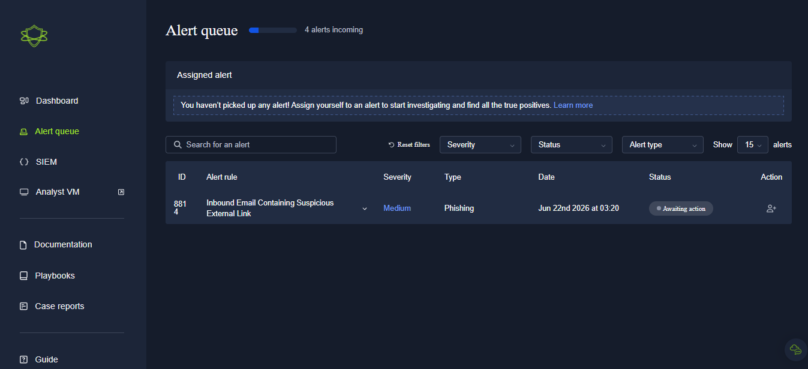

### Phase 3 — Assigning the Alert
Assigned Alert 8818 to myself to begin the investigation.

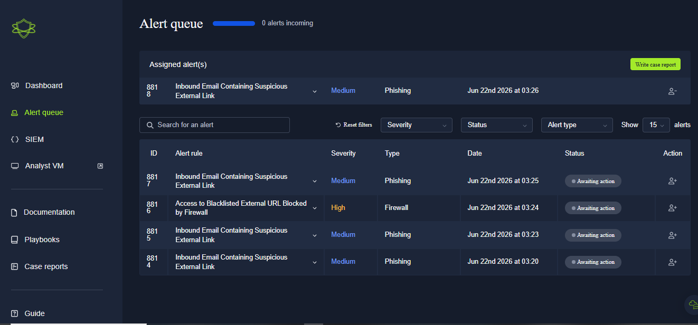

### Phase 4 — Reviewing Alert Details
Opened the raw email data:
- **Sender:** `onboarding@hrconnex.thm`
- **Recipient:** `j.garcia@thetrydaily.thm`
- **Subject:** Action Required: Finalize Your Onboarding Profile
- **Link:** `https://hrconnex.thm`

On the surface, this looked like a generic phishing pattern — an email with an external link. Not enough on its own to call a verdict either way.

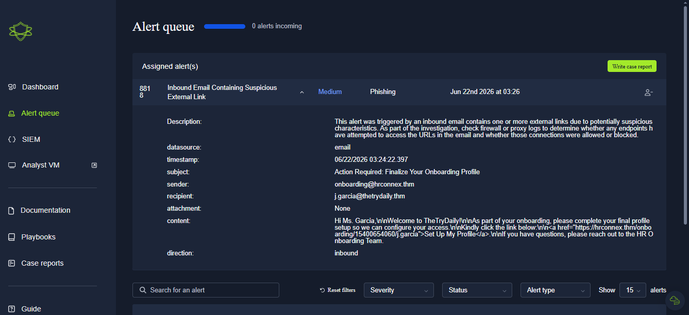

### Phase 5 — SIEM Investigation: Domain History
Searched `hrconnex.thm` in Splunk to check for prior activity tied to this domain.

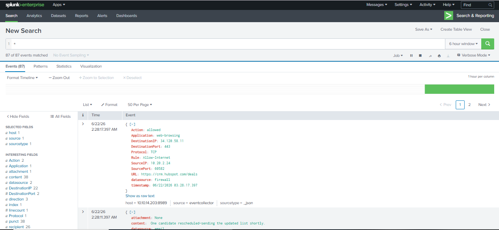

Found two internal emails:
- An employee (`h.harris`) had filed an IT ticket explaining that a new hire (`j.garcia`) hadn't received the onboarding link from the company's third-party HR provider, `hrconnex.thm`.
- This confirmed the domain and email were legitimate, business-approved communication — not phishing.

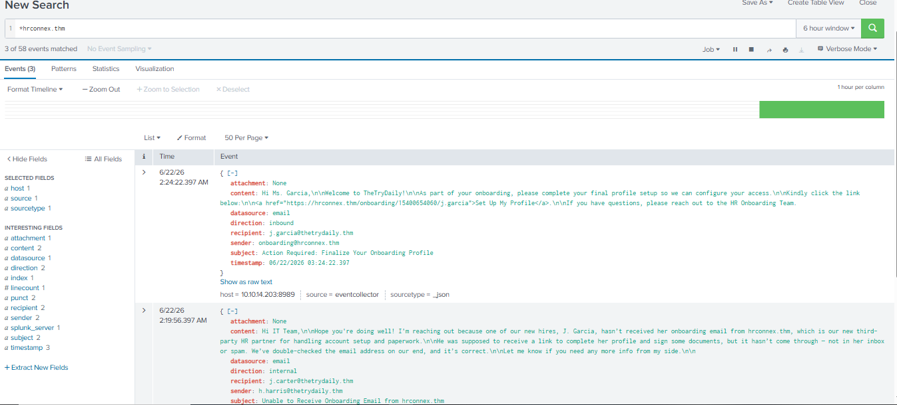

### Phase 6 — Filing the Case Report (Alert 1)
Filled out the case report and marked Alert 8818 as a **False Positive** — a legitimate HR onboarding email, confirmed by internal ticket history.

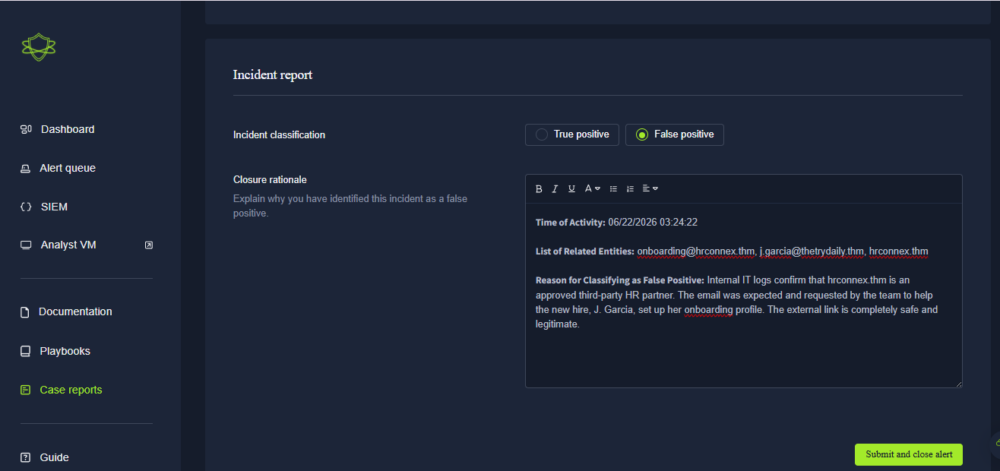
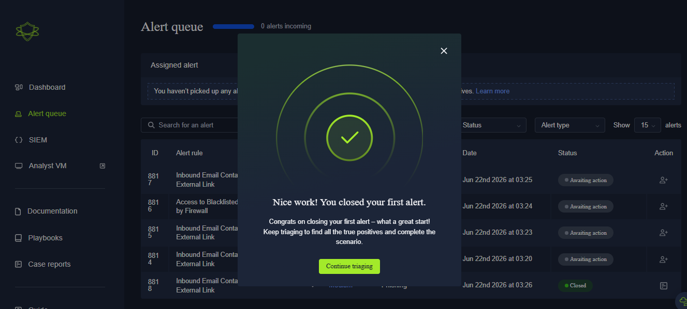

### Phase 7 — Second Alert: Typosquat Phishing Domain
Opened the next alert:
- **Alert ID:** 8817
- **Sender:** `no-reply@m1crosoftsupport.co` (note the "1" replacing the "i" — a typosquatting domain)
- **Subject:** Unusual Sign-In Activity on Your Microsoft Account
- **Link:** `https://m1crosoftsupport.co`

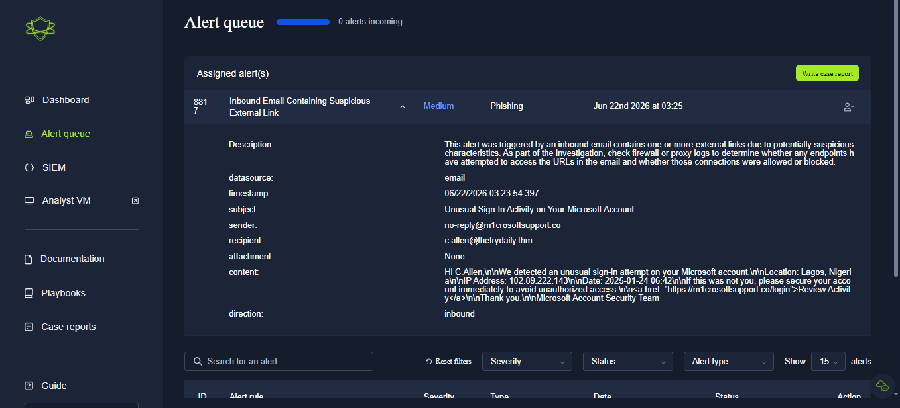

### Phase 8 — SIEM Investigation: Confirming the Click
Searched the fake domain in Splunk and found 2 related events.

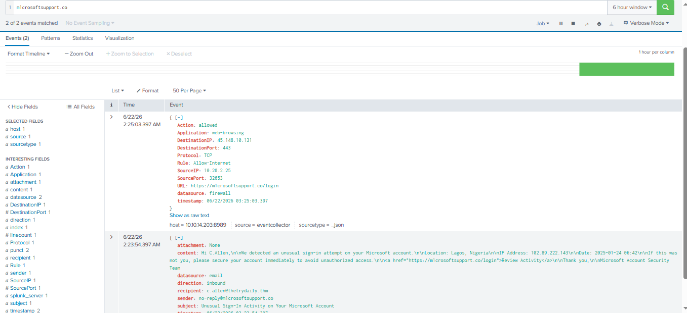

Checked the firewall logs directly and found an employee had actually clicked the link:
- **Source IP:** `10.20.2.25` (internal employee machine)
- **Firewall Action:** `allowed`

This confirmed the click went through — a real **True Positive**.

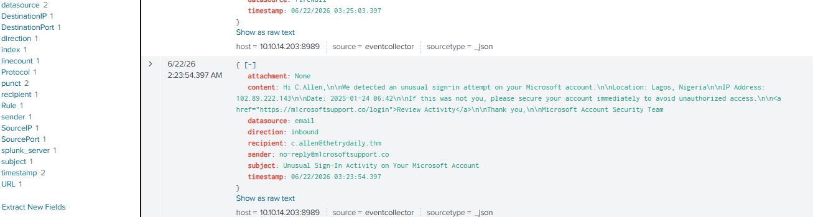

### Phase 9 — Filing the Case Report (Alert 2)
Submitted the final case report:
- **Verdict:** True Positive
- **Escalate:** Yes
- **Remediation:** Isolate the affected machine (`10.20.2.25`) from the network, force a password reset for the employee

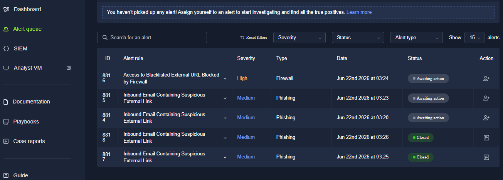

---

## Key Lesson
Both alerts started with the exact same surface-level pattern — "email with external link." The verdict came down entirely to what the SIEM logs and firewall data showed, not how the email looked. Alert 1's domain had internal ticket history backing it as legitimate; Alert 2's domain showed a firewall log confirming the user actually clicked through. Surface impressions are a starting point, not a verdict — the SIEM pivot is what actually decides True Positive vs False Positive.

---

## Real-World Application
This is the daily core of Tier 1 SOC work: high alert volume, most of it benign, but the real threats need to be caught and escalated fast with clear evidence. Knowing how to pivot from an alert to log data — instead of guessing from the alert description alone — is what separates a useful analyst from one who either escalates everything (alert fatigue for the whole team) or dismisses everything (a missed real breach).

---

## Evidence & Screenshots
| Screenshot | What It Shows |
|---|---|
| `SS1_Introduction_to_Phishing_Dashboard.PNG` | SOC Simulator loaded, Scenario 1 ready |
| `SS2_Introduction_to_Phishing_Alert_Queue.PNG` | Alert queue, 5 pending alerts |
| `SS3_Assigned_Alert.PNG` | Alert 8818 assigned for investigation |
| `SS4_Alert_Details.PNG` | Raw email data for Alert 8818 |
| `SS5_SIEM_Search.PNG` | Splunk search for `hrconnex.thm` |
| `SS6_SIEM_Results.PNG` | Internal ticket history confirming legitimacy |
| `SS7_Filling_Case_Report.PNG` | Case report being completed for Alert 8818 |
| `SS8_Case_Report_Submitted.PNG` | False Positive verdict submitted |
| `SS9_Second_Alert_Details.PNG` | Alert 8817 — typosquat phishing domain details |
| `SS10_SIEM_Phishing_Search.PNG` | Splunk search for `m1crosoftsupport.co` |
| `SS11_SIEM_Phishing_Proof.PNG` | Firewall log confirming the malicious click |
| `SS12_True_Positive_Submitted.PNG` | True Positive verdict, escalation, and remediation steps |

---

## Files
| File | Description |
|------|-------------|
| `README.md` | Full project documentation |

---

## References
- [TryHackMe SOC Simulator](https://tryhackme.com/module/soc-simulator)
