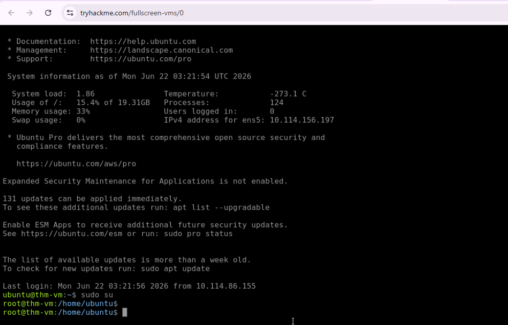
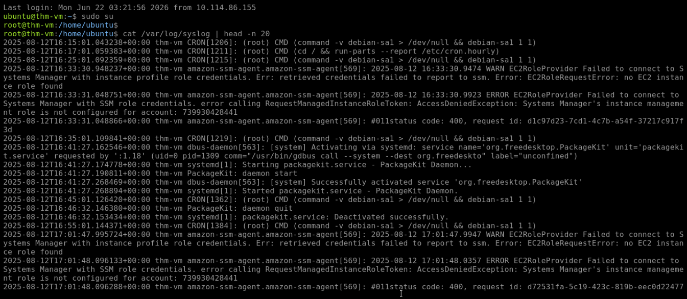
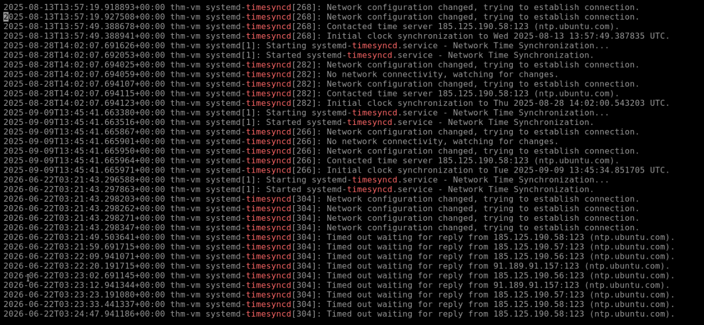
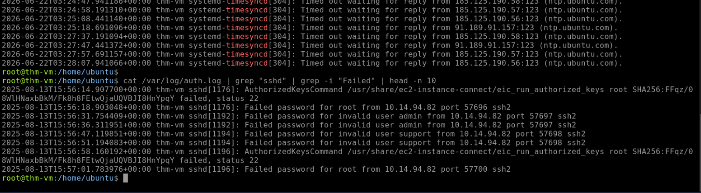
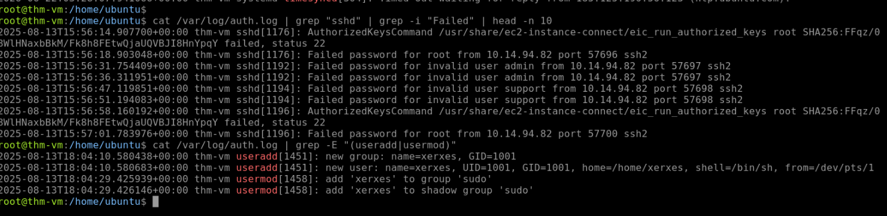
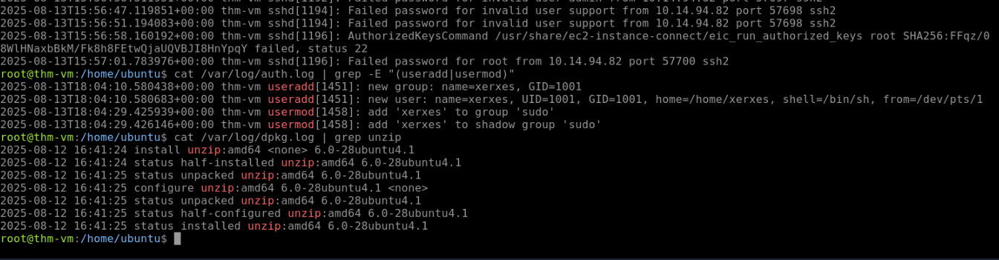
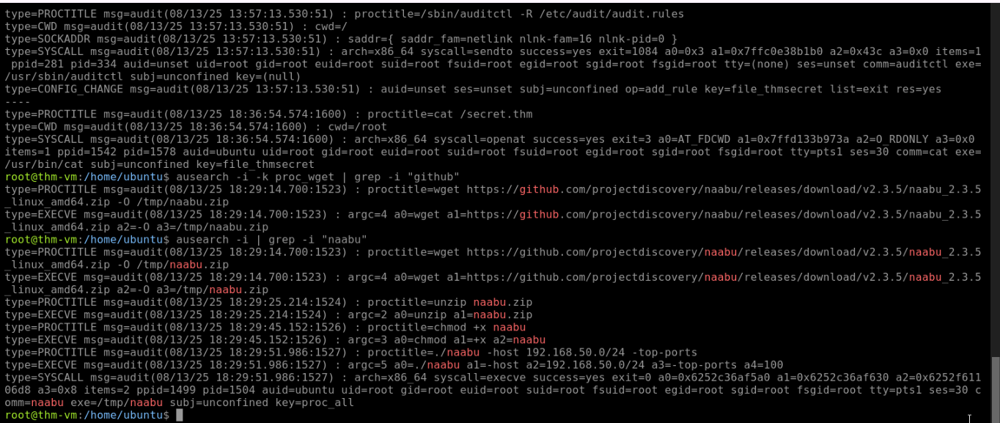

# Project 9 — Linux Log Analysis & Forensics (SOC Investigation)

---

## Objective
I investigated a compromised Linux machine using only its built-in log files — no SIEM, no EDR dashboard — to reconstruct the attacker's full timeline: how they got in, what they did once inside, and what tools they used to move further. This is core Linux host forensics, the kind of investigation a SOC analyst runs directly on a server after a suspected breach.

---

## Tools Used
| Tool | Purpose | Why I Chose It |
|---|---|---|
| Linux CLI (`grep`, `cat`, `head`) | Filtering and reading plaintext log files | Most Linux logs live in plain text under `/var/log` — no GUI, just command-line filtering |
| `auditd` / `ausearch` | Detailed file access and process execution tracking | Goes beyond basic logs to show exact file opens, downloads, and process activity tied to specific audit keys |

---

## Build Process

### Phase 1 — Machine Connection & Root Access
Connected to the target machine via SSH and ran `sudo su` to get root access, needed to read the protected log files.

### Phase 2 — Syslog Analysis
Ran `cat /var/log/syslog | head -n 20` to check overall system health. Found Amazon SSM agent access errors — system-level noise, not directly malicious, but useful baseline context.

### Phase 3 — NTP Time Sync Check
Checked time synchronization logs to confirm the system clock source — important for trusting timestamps in the rest of the investigation. *(Confirm exact domain from your own screenshot — likely `ntp.ubuntu.com`.)*

### Phase 4 — Auth Log Investigation: Brute Force Attack Found
Checked `/var/log/auth.log` for authentication activity. Found the attacker's entry point: IP `10.14.94.82` running automated password-guessing attempts against `root`, `admin`, and `support` accounts.

### Phase 5 — Backdoor User Creation Found
Filtered `auth.log` for `useradd`/`usermod` events. Found that after breaking in, the attacker created a new account (`xerxes`) and added it to the `sudo` group — a backdoor with full admin rights.

### Phase 6 — Malicious Software Installation Check
Checked `/var/log/dpkg.log` (Debian package manager logs). Found the attacker installed `unzip` (version `6.0-28ubuntu4.1`) — used to extract a downloaded archive.

### Phase 7 — Auditd Analysis: Hacker Tools & Network Scan
Used `ausearch` to dig into audit-level events:
- A sensitive file, `secret.thm`, was opened at `08/13/25 18:36:54`
- The attacker used `wget` to download `naabu_2.3.5_linux_amd64.zip` from GitHub — a network scanning tool
- That tool was then used to scan the internal network range `192.168.50.0/24`

---

## Key Lesson
No single log told the full story. `auth.log` showed the break-in and the backdoor account, `dpkg.log` showed the tool installation, and `auditd` showed the file access and network scan — each one only a fragment. The actual attacker timeline (brute force → backdoor account → tool download → internal network scan) only became clear by correlating evidence across all of them. Real Linux host forensics is rarely a single log lookup; it's piecing together a timeline from multiple sources.

---

## Real-World Application
This is exactly what a SOC or IR analyst does when a Linux server is suspected of compromise: pull `auth.log`, `dpkg.log`, `syslog`, and `auditd` records, and reconstruct what happened step by step. Knowing where each piece of evidence lives — and that you need more than one log source to confirm a full attack chain — is a foundational Linux security skill, distinct from the SIEM/dashboard-based triage in other projects.

---

## Evidence & Screenshots
| Screenshot | What It Shows |
|---|---|
| `SS1_Linux_Logs_Connection.PNG` | SSH connection and root access established |
| `SS2_Syslog_Analysis.PNG` | System health check via syslog |
| `SS3_Syslog_Timesync.PNG` | NTP time sync source confirmed |
| `SS4_Auth_Failed_Logins.PNG` | Brute force attempts from `10.14.94.82` |
| `SS5_Auth_Sudo_User.PNG` | Backdoor user `xerxes` added to sudo group |
| `SS6_Package_Manager_Logs.PNG` | `unzip` installation found in dpkg logs |
| `SS7_Auditd_Analysis.PNG` | File access timestamp, tool download, and network scan range |

---

## Files
| File | Description |
|------|-------------|
| `README.md` | Full project documentation |

---

## References
- [TryHackMe — Linux Logging for SOC](https://tryhackme.com/room/linuxloggingforsoc)
